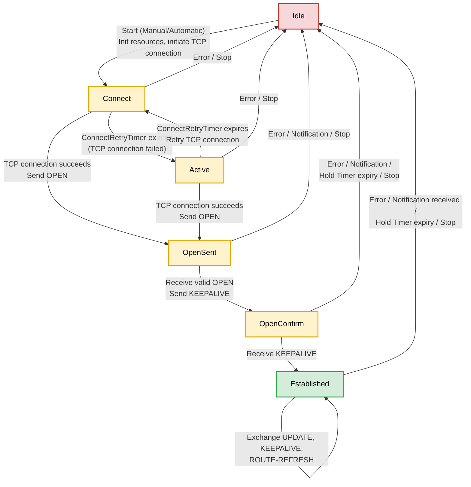

## ASN & BGP Neighbor States

> 💡 **TL;DR:** ASNs were originally 2-byte (0–65535), now extended to 4-byte (RFC 6793) to handle exhaustion. BGP neighbor states progress Idle → Connect → Active → OpenSent → OpenConfirm → Established, with all failures dropping straight back to Idle.

---

### Autonomous System Number (ASN)

- Originally a **2-byte** number: range **0 – 65535**
- **Public ASNs:** 1 – 64495 (assigned by IANA/RIRs for global use)
- **Reserved for documentation/sample code:** 64496 – 64511 (RFC 5398)
- **Private ASNs:** 64512 – 65534 (for internal/local use, not advertised to the internet)
- **Reserved:** 0 and 65535

> ⚠️ **Correction:** The commonly quoted "Public 1–64511 / Private 64512–65535" splits things slightly imprecisely — 64496–64511 is actually reserved for documentation (RFC 5398), and 65535 is reserved, not usable as a private ASN.

- Newer implementations use a **4-byte ASN field**, standardized in **RFC 6793** (this obsoleted the original RFC 4893).
- 4-byte ASN range: **0 – 4,294,967,295** (asplain notation), or written in **asdot** notation as `x.y` where x and y each range 0–65535 (e.g., `1.0` = 65536 in asplain).

---

### BGP Neighbor States (FSM)

| State | Description |
|---|---|
| **Idle** | Initial state — BGP refuses incoming connections, waiting for a Start event |
| **Connect** | BGP speaker is **waiting for the TCP connection to complete** |
| **Active** | BGP speaker is **trying to initiate** a TCP connection with the peer |
| **OpenSent** | Sent an OPEN message, waiting to hear back from the neighbor |
| **OpenConfirm** | OPEN messages already exchanged; waiting for a KEEPALIVE |
| **Established** | Full peering relationship — routes can be exchanged |

> ⚠️ **Correction:** Connect and Active are commonly mixed up. Per RFC 4271:
> - **Connect** = waiting for the TCP handshake to **finish** (connection already initiated)
> - **Active** = actively **trying to initiate** a new TCP connection (typically after a previous attempt failed)
>
> It's counterintuitive that "Active" is the retry/failure-recovery state rather than the first attempt — worth memorizing deliberately since the naming doesn't hint at it.

---

### BGP FSM Diagram



**Notes:**
- No "Closing" state in RFC 4271 — all failures go directly back to **Idle**
- Connect ↔ Active retry loop exists via the **ConnectRetryTimer**
- ROUTE-REFRESH is an extension (RFC 2918), not in the base spec

#### Sample Router Output

```log
ce# show ip bgp summary 
              
BGP router identifier 100.64.255.5, local AS number 64514
BGP table version is 3, main routing table version 3
2 network entries using 496 bytes of memory
3 path entries using 408 bytes of memory
3/2 BGP path/bestpath attribute entries using 888 bytes of memory
2 BGP AS-PATH entries using 80 bytes of memory
0 BGP route-map cache entries using 0 bytes of memory
0 BGP filter-list cache entries using 0 bytes of memory
BGP using 1872 total bytes of memory
BGP activity 2/0 prefixes, 3/0 paths, scan interval 60 secs
2 networks peaked at 23:02:59 Jun 20 2026 IST (00:00:08.823 ago)

Neighbor        V           AS MsgRcvd MsgSent   TblVer  InQ OutQ Up/Down  State/PfxRcd
100.64.255.2    4        64512       6       5        3    0    0 00:01:04        1
100.64.255.6    4        64513       5       5        3    0    0 00:01:06        1
```

```log
ce#show ip bgp neighbors 100.64.255.2

BGP neighbor is 100.64.255.2,  remote AS 64512, external link
  BGP version 4, remote router ID 100.64.0.2
  BGP state = Established, up for 00:01:08  <<<<<<< BGP state
  Last read 00:00:09, last write 00:00:09, hold time is 180, keepalive interval is 60 seconds   <<<<< Timers
  Last update received: 00:00:09
  Neighbor sessions:
    1 active, is not multisession capable (disabled)
  Neighbor capabilities:
    Route refresh: advertised and received(new)
    Four-octets ASN Capability: advertised and received
    Address family IPv4 Unicast: advertised and received
    Enhanced Refresh Capability: advertised and received
    Multisession Capability: 
    Stateful switchover support enabled: NO for session 1
  Message statistics:
    InQ depth is 0
    OutQ depth is 0
    
                         Sent       Rcvd
    Opens:                  1          1
    Notifications:          0          0
    Updates:                2          3
    Keepalives:             2          2
    Route Refresh:          0          0
    Total:                  5          6
  Do log neighbor state changes (via global configuration)
  Default minimum time between advertisement runs is 30 seconds

 For address family: IPv4 Unicast
  Session: 100.64.255.2
  BGP table version 3, neighbor version 3/0
  Output queue size : 0
  Index 1, Advertise bit 0
  1 update-group member
  Outbound path policy configured
  Route map for outgoing advertisements is 1
  Slow-peer detection is disabled
  Slow-peer split-update-group dynamic is disabled
                                 Sent       Rcvd
  Prefix activity:               ----       ----
    Prefixes Current:               1          1 (Consumes 136 bytes)
    Prefixes Total:                 1          1
    Implicit Withdraw:              0          0
    Explicit Withdraw:              0          0
    Used as bestpath:             n/a          0
    Used as multipath:            n/a          0
    Used as secondary:            n/a          0

                                   Outbound    Inbound
  Local Policy Denied Prefixes:    --------    -------
    AS_PATH loop:                       n/a          1
    Other Policies:                       1        n/a
    Total:                                1          1
  Number of NLRIs in the update sent: max 1, min 0
  Current session network count peaked at 1 entries at 23:03:01 Jun 20 2026 IST (00:00:10.119 ago)
  Highest network count observed at 1 entries at 23:03:01 Jun 20 2026 IST (00:00:10.119 ago)
  Last detected as dynamic slow peer: never
  Dynamic slow peer recovered: never
  Refresh Epoch: 1
  Last Sent Refresh Start-of-rib: never
  Last Sent Refresh End-of-rib: never
  Last Received Refresh Start-of-rib: never
  Last Received Refresh End-of-rib: never
                                       Sent       Rcvd
        Refresh activity:              ----       ----
          Refresh Start-of-RIB          0          0
          Refresh End-of-RIB            0          0

  Address tracking is enabled, the RIB does have a route to 100.64.255.2
  Route to peer address reachability Up: 1; Down: 0
    Last notification 00:01:18
  Connections established 1; dropped 0
  Last reset never
  External BGP neighbor configured for connected checks (single-hop no-disable-connected-check)
  Interface associated: Ethernet0/1 (peering address in same link)
  Transport(tcp) path-mtu-discovery is enabled  <<<< PMTUD enabled
  Graceful-Restart is disabled
  SSO is disabled
Connection state is ESTAB, I/O status: 1, unread input bytes: 0            
Connection is ECN Disabled, Mininum incoming TTL 0, Outgoing TTL 1  <<<< As it is a eBGP by default TTL is 1
Local host: 100.64.255.1, Local port: 63020
Foreign host: 100.64.255.2, Foreign port: 179  <<<< BGP server selection
Connection tableid (VRF): 0
Maximum output segment queue size: 50

Enqueued packets for retransmit: 0, input: 0  mis-ordered: 0 (0 bytes)

Event Timers (current time is 0x14C31):
Timer          Starts    Wakeups            Next
Retrans             4          0             0x0
TimeWait            0          0             0x0
AckHold             4          2             0x0
SendWnd             0          0             0x0
KeepAlive           0          0             0x0
GiveUp              0          0             0x0
PmtuAger            1          0         0x969DA
DeadWait            0          0             0x0
Linger              0          0             0x0
ProcessQ            0          0             0x0

iss:   20273499  snduna:   20273672  sndnxt:   20273672
irs: 2417306069  rcvnxt: 2417306291

sndwnd:  16212  scale:      0  maxrcvwnd:  16384
rcvwnd:  16163  scale:      0  delrcvwnd:    221

SRTT: 413 ms, RTTO: 3205 ms, RTV: 2792 ms, KRTT: 0 ms
minRTT: 4 ms, maxRTT: 1000 ms, ACK hold: 120 ms
uptime: 68125 ms, Sent idletime: 9238 ms, Receive idletime: 9359 ms 
Status Flags: active open
Option Flags: nagle, path mtu capable, SACK option permitted    <<< PMTU enable
  win-scale
IP Precedence value : 6
Window update Optimisation : Enabled
ACK Optimisation : Dynamic ACK Tuning Enabled

Datagrams (max data segment is 1460 bytes):
Peer MSS:       1460
Rcvd: 8 (out of order: 0), with data: 4, total data bytes: 221
Sent: 9 (retransmit: 0, fastretransmit: 0, partialack: 0, Second Congestion: 0), with data: 4, total data bytes: 172

 Packets received in fast path: 0, fast processed: 0, slow path: 0
 fast lock acquisition failures: 0, slow path: 0
TCP Semaphore      0x7FFFDCEA4AF0  FREE 
```
