## BGP NLRI, Attributes & Path Selection

> 💡 **TL;DR:** BGP learns prefixes 3 ways — `network` statement (ORIGIN i, weight 32768), redistribution (ORIGIN ?), or conditional advertisement. Every prefix carries attributes (some mandatory, some optional/transitive) that feed into a strict 13-step best-path algorithm — Weight and Local Preference dominate early, AS_PATH/MED/origin type matter next, and Router ID is the final tiebreaker.

---

## BGP NLRI (Network Layer Reachability Information)

### Network Statement

- Must be an **exact match** for a prefix already in the global RIB.
- Sends the prefix into BGP with an **ORIGIN code of IGP (`i`)**.
- Locally originated routes (via `network` statement) are preferred over routes learned via other methods, due to the **default weight of 32768**.

```cisco
router bgp 100
 network 1.1.1.1 mask 255.255.255.255
```

> ⚠️ **Gotcha:** `network 1.1.1.1` with no mask defaults to a **classful mask** — in this case `255.0.0.0` (assumes `1.0.0.0/8`), not a /32. Always specify the mask explicitly.

---

### Redistribution

- ORIGIN code is **Incomplete (`?`)**.
- If `auto-summary` is enabled under the BGP process, redistributed routes can be **aggregated/advertised as classful** — this does **not** affect prefixes sourced via the `network` statement.
- OSPF **external** routes (E1, E2, N1, N2) are **not redistributed by default**.

```cisco
router bgp 100
 redistribute ospf 1 match internal external
```

- Locally originated prefixes (via redistribution) also get the default weight of **32768**, same as the `network` statement.

---

### BGP Conditional Advertisements

Advertise a prefix only if a certain condition is (or isn't) met in the routing table — useful for backup path / multihoming scenarios.

```cisco
neighbor <ip> advertise-map <map1> [non-exist-map <map2> | exist-map <map2>]
```

**Example:**
```cisco
router bgp 100
 network 172.16.57.0 mask 255.255.255.0
 neighbor 172.16.75.7 advertise-map ADV-1 non-exist-map NON-EXIST-1

route-map ADV-1 permit 10
 match ip address prefix-list pl-adv-1

ip prefix-list pl-adv-1 permit 5.5.5.5/32

route-map NON-EXIST-1
 match ip address prefix-list pl-non-exist-1

ip prefix-list pl-non-exist-1 permit 172.16.57.0/24
```

> 📝 **Reading it:** Advertise `172.16.57.0/24` **only if** `5.5.5.5/32` does **not** exist in the BGP table (`non-exist-map`). Common for "advertise this backup path only if the primary path disappears."

---

## BGP Attributes

Path attributes are carried as **TLVs** (Type-Length-Value) inside UPDATE messages:

| Field | Size | Purpose |
|---|---|---|
| Attribute Type | 2 bytes | 1 byte = flags (well-known/optional, transitive, partial, extended-length), 1 byte = attribute type code |
| Attribute Length | 1 or 2 bytes | 1 byte normally; 2 bytes if the Extended Length flag is set |
| Attribute Value | Variable | The actual attribute data |

> 📝 **Clarification:** Only the **Attribute Type** field is a fixed 2 bytes (flags + type code). Length and Value are variable — the "two bytes" description refers just to the type/flags portion, not the whole attribute.

### Attribute Categories

| Category | Must Be Understood by All Speakers? | Must Appear in Every UPDATE? | Passed to Other Peers? |
|---|:---:|:---:|:---:|
| **Well-known Mandatory** | ✅ Yes | ✅ Yes | ✅ Always |
| **Well-known Discretionary** | ✅ Yes | ❌ No | ✅ Always |
| **Optional Transitive** | ❌ No | ❌ No | ✅ Yes (Transitive flag set) |
| **Optional Non-Transitive** | ❌ No | ❌ No | ❌ No (not passed further) |

### Attribute Type Codes

| Type Code | Attribute Name | Category |
|---:|---|---|
| 1 | ORIGIN | Well-known Mandatory |
| 2 | AS_PATH | Well-known Mandatory |
| 3 | NEXT_HOP | Well-known Mandatory |
| 4 | MULTI_EXIT_DISC (MED) | Optional Non-Transitive |
| 5 | LOCAL_PREF | Well-known Discretionary |
| 6 | ATOMIC_AGGREGATE | Well-known Discretionary |
| 7 | AGGREGATOR | Optional Transitive |
| 8 | COMMUNITY | Optional Transitive |
| 9 | ORIGINATOR_ID | Optional Non-Transitive |
| 10 | CLUSTER_LIST | Optional Non-Transitive |
| 11 | DPA (Destination Preference Attribute) | Deprecated / Historic |
| 12 | ADVERTISER | BGP Route Server Attribute (deprecated) |
| 13 | RCID_PATH / CLUSTER_ID | BGP Route Server Attribute (deprecated) |
| 14 | MP_REACH_NLRI | Optional Non-Transitive |
| 15 | MP_UNREACH_NLRI | Optional Non-Transitive |
| 16 | EXTENDED_COMMUNITIES | Optional Transitive |

```mermaid
flowchart TD
    Root["BGP Attributes"]

    Root --> WKM["Well-known Mandatory"]
    Root --> WKD["Well-known Discretionary"]
    Root --> OT["Optional Transitive"]
    Root --> ONT["Optional Non-Transitive"]
    Root --> DEP["Deprecated / Historic"]

    WKM --> WKM1["1 · ORIGIN"]
    WKM --> WKM2["2 · AS_PATH"]
    WKM --> WKM3["3 · NEXT_HOP"]

    WKD --> WKD1["5 · LOCAL_PREF"]
    WKD --> WKD2["6 · ATOMIC_AGGREGATE"]

    OT --> OT1["7 · AGGREGATOR"]
    OT --> OT2["8 · COMMUNITY"]
    OT --> OT3["16 · EXTENDED_COMMUNITIES"]

    ONT --> ONT1["4 · MULTI_EXIT_DISC (MED)"]
    ONT --> ONT2["9 · ORIGINATOR_ID"]
    ONT --> ONT3["10 · CLUSTER_LIST"]
    ONT --> ONT4["14 · MP_REACH_NLRI"]
    ONT --> ONT5["15 · MP_UNREACH_NLRI"]

    DEP --> DEP1["11 · DPA"]
    DEP --> DEP2["12 · ADVERTISER"]
    DEP --> DEP3["13 · RCID_PATH / CLUSTER_ID"]

    classDef root fill:#e2e3ff,stroke:#4b4bce,stroke-width:2px,color:#000
    classDef category fill:#fff3cd,stroke:#e0a800,stroke-width:2px,color:#000
    classDef wkm fill:#f8d7da,stroke:#c0392b,stroke-width:1px,color:#000
    classDef wkd fill:#ffe5cc,stroke:#e08000,stroke-width:1px,color:#000
    classDef ot fill:#d4edda,stroke:#28a745,stroke-width:1px,color:#000
    classDef ont fill:#d0e7ff,stroke:#1a73c7,stroke-width:1px,color:#000
    classDef dep fill:#e2e2e2,stroke:#7d7d7d,stroke-width:1px,color:#000

    class Root root
    class WKM,WKD,OT,ONT,DEP category
    class WKM1,WKM2,WKM3 wkm
    class WKD1,WKD2 wkd
    class OT1,OT2,OT3 ot
    class ONT1,ONT2,ONT3,ONT4,ONT5 ont
    class DEP1,DEP2,DEP3 dep
```




---

## BGP Path Selection

### Prerequisites (before best-path even runs)

1. **Reachability to the next hop** — must have a route to the BGP next hop in the RIB.
2. **BGP Synchronization** — historically required that iBGP routes have a matching IGP route before being used/advertised (mainly relevant on AS edge routers).
3. **AS_PATH must not contain my own AS** — core eBGP loop prevention; override with `neighbor ... allow-as in`.
4. **First ASN in AS_PATH must be my directly connected peer's AS** — security mechanism against route injection; enforced via `bgp enforce-first-as`.

> ⚠️ **Note:** BGP synchronization is **disabled by default** on modern Cisco IOS (12.2(8)T+) and is largely obsolete/irrelevant in current designs — included here mostly for legacy/exam completeness.

---

### The 13-Step Best Path Algorithm

| # | Rule | Direction | Better Value |
|---|---|---|---|
| 1 | **Highest WEIGHT** (Cisco proprietary) | Inbound policy | Higher |
| 2 | **Highest LOCAL_PREF** | Inbound policy | Higher |
| 3 | **Prefer locally originated** path (`network`, redistribution, `aggregate-address`) | — | — |
| 4 | **Shortest AS_PATH** | In/Outbound policy | Shorter |
| 5 | **Lowest ORIGIN type** (`i` > `e` > `?`) | — | IGP best |
| 6 | **Lowest MED** | Outbound policy (suggestion to peer) | Lower |
| 7 | **Prefer eBGP over iBGP** | — | eBGP wins |
| 8 | **Lowest IGP metric to next hop** | — | Lower |
| 9 | **Multipath**: install multiple paths if `maximum-paths` configured | — | — |
| 10 | **Oldest route** (if both paths are eBGP-external) | — | Oldest wins |
| 11 | **Lowest Router ID** | — | Lower |
| 12 | **Lowest CLUSTER_LIST length** (if Router ID/Originator ID tie) | — | Shorter |
| 13 | **Lowest neighbor IP address** | — | Lower |

#### Step Details Worth Remembering

**Step 1 — WEIGHT**
- Cisco-proprietary, **inbound-only**, locally significant (never propagated).
- Range: 0 – 65,535.
- Default: **32768** for self-originated routes, **0** for all others.
```cisco
neighbor <ip> weight <value>
! or via route-map:
neighbor <ip> route-map <NAME> in
```

**Step 2 — LOCAL_PREF**
- Well-known discretionary, propagates **throughout the AS** (iBGP only — never sent to eBGP peers, though it does carry across confederation eBGP boundaries).
- Default: **100**.
```cisco
bgp default local-preference <value>
```

**Step 4 — AS_PATH**
- An AS_SET (from aggregation) counts as **length 1** regardless of how many ASNs it contains.
- Can be ignored with `bgp bestpath as-path ignore`, or manipulated via route-maps / AS-path prepending.

**Step 5 — ORIGIN**
- Preference order: **IGP (`i`) > EGP (`e`) > Incomplete (`?`)**.

**Step 6 — MED**
- Optional non-transitive — a *suggestion* from one AS to a neighboring AS about which entry point to use for a prefix.
- **Lower is better.** The receiving peer can choose to ignore it entirely.

> 📝 **Steps 7–13 note:** These are lower-priority tiebreakers, rarely reached in practice since Weight/Local Pref/AS_PATH usually decide the outcome first — but they matter in flat/symmetric topologies where earlier attributes are identical.

---

### Best Path Exceptions / Tuning Commands

| Command | Effect |
|---|---|
| `bgp bestpath as-path ignore` | Skips AS_PATH length comparison (step 4) |
| `bgp always-compare-med` | Compares MED even across different neighboring ASes |
| `bgp bestpath med-confed` | Compares MED only among confederation sub-AS peers |
| `bgp bestpath med missing-as-worst` | Treats a missing MED as the **worst** possible value (4,294,967,294) instead of the default of 0 |
| `bgp deterministic med` | Compares MED against all paths from a given AS together, changing selection order/grouping |
| `bgp bestpath igp-metric ignore` | Skips the IGP-metric-to-next-hop comparison (step 8) |
| `no bgp bestpath compare-routerid` | Disables Router ID comparison (step 11) |

> ⚠️ **Gotcha:** Default missing MED value is treated as **0** (best), not infinite — the opposite of what you might expect ("no MED sent" ends up looking like the *best* option unless you explicitly configure `missing-as-worst`).