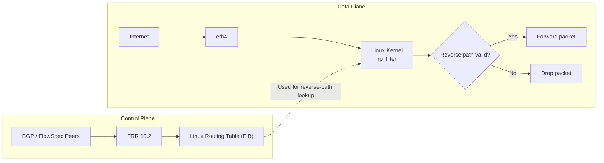

# BGP Security — Source-Based RTBH (S/RTBH)

> 💡 **TL;DR:** Source-Based RTBH (S/RTBH) is the more granular sibling of Destination-Based RTBH — instead of black-holing the *victim*, it black-holes the *attacker's source IP*, so legitimate traffic to the victim keeps flowing while only the attack traffic is dropped. It reuses the same BGP discard-route and community mechanics as Destination-Based RTBH, but adds one more ingredient: **uRPF (Unicast Reverse Path Forwarding)**, which is what actually causes edge routers to drop spoofed/attacker traffic once the black-hole route exists in their FIB.

Related: [[BGP Security — Destination-Based RTBH]] · [[BGP Attributes]] · [[BGP Community]] · [[BGP Filtering]]

Reference: [RFC 5635 — Remote Triggered Black Hole Filtering with BGP](https://datatracker.ietf.org/doc/html/rfc5635)

---

## Table of Contents

- [Recap — Shared RTBH Concepts](#recap--shared-rtbh-concepts)
- [Source Based RTBH](#source-based-rtbh)
  - [uRPF (Unicast Reverse Path Forwarding Check)](#urpf-unicast-reverse-path-forwarding-check)
  - [Next-Hop Attribute Based S/RTBH (Lab)](#next-hop-attribute-based-srtbh-lab)
  - [S/RTBH with FRR — Linux rp_filter](#srtbh-with-frr--linux-rp_filter)
  - [FRR Flowspec/S-RTBH Full Lab](#frr-flowspecs-rtbh-full-lab)
- [References](#references)

---

## Recap — Shared RTBH Concepts

S/RTBH reuses the same foundational BGP mechanics covered in [[BGP Security — Destination-Based RTBH]]:

- **BGP discard routes** — a static route to a discard/Null0 next-hop (conventionally `192.0.2.1`), used to actually drop traffic once installed in the FIB.
- **BGP communities** — `NO_EXPORT` keeps the black-hole trigger contained within the local AS, never leaking to eBGP peers.
- **BGP Next-Hop attribute manipulation** — the trigger router rewrites the NEXT_HOP of a black-holed prefix to point at the discard route, and this propagates via iBGP to every edge router.

> 📝 See the other note for the full breakdown of these mechanics with examples — this note focuses on what's **additionally** needed for source-based filtering.

---

## Source Based RTBH

- A **more granular** implementation than Destination-Based RTBH.
- Filters/drops **all traffic from a particular source** — the identified source of the DoS attack.
- A **dedicated Trigger router becomes necessary** (as opposed to the CE sometimes doubling as the trigger in destination-based RTBH).
- The trigger router still has multiple signaling options:
  - Communities
  - Next-Hop alteration
- All concepts of Destination-Based RTBH still apply:
  - BGP discard route
  - BGP communities
- **Additional concept:** the **uRPF check** is leveraged to make source-based filtering actually work.

---

### uRPF (Unicast Reverse Path Forwarding Check)

- A **general security feature**, unrelated to RTBH on its own — but it's the exact mechanism S/RTBH depends on.
- The router verifies the **reachability of the source IP address** of incoming packets:
  - **Strict Mode** — the egress route back to the source must point out the **same interface** the packet arrived on.
  - **Loose Mode** — a route must simply **exist in the FIB** for the source, regardless of interface.
    - S/RTBH implementations will consider a **"discard" route as invalid** for reachability purposes.
    - This is the exact behavior S/RTBH leverages.
- **How the S/RTBH + uRPF combination works:**
  1. The trigger router originates an NLRI for the malicious source IP, with its next-hop set to the discard address.
  2. Edge routers (via iBGP) install a **discard route in the FIB** for that source IP.
  3. The **uRPF feature** on the edge router's ingress interface then checks incoming packets' source IPs against the FIB — since the route for that source now points to discard, uRPF fails the check and the packet is **dropped**.

> 📝 **Two implementation styles, same as destination-based:**
> - **Next-Hop attribute based RTBH** — Trigger Router Originated
> - **Community attribute based RTBH** — Trigger Router Originated
>
> The lab below demonstrates the **Next-Hop attribute based** approach for S/RTBH.

### Network Diagram


---

### Next-Hop Attribute Based S/RTBH (Lab)

#### Before Config

**ios-ed1 op:-**

```log
ios-ed1#show ip bgp
BGP table version is 30, local router ID is 10.0.1.3
Status codes: s suppressed, d damped, h history, * valid, > best, i - internal,
              r RIB-failure, S Stale, m multipath, b backup-path, f RT-Filter,
              x best-external, a additional-path, c RIB-compressed,
              t secondary path, L long-lived-stale,
Origin codes: i - IGP, e - EGP, ? - incomplete
RPKI validation codes: V valid, I invalid, N Not found

     Network          Next Hop            Metric LocPrf Weight Path
 *>i  10.10.10.10/32   10.0.1.5                 0    120      0 65001 i
 *bi                   10.0.1.6                      120      0 65001 i
 *bi  11.11.11.11/32   10.0.1.6                      100      0 65001 i
 *>i                   10.0.1.5                 0    100      0 65001 i
 *>   172.16.1.0/24    10.0.4.2                      120      0 65002 i
 *>   172.17.1.0/24    10.0.6.2                 0             0 65003 i
 *>i  172.18.1.0/24    10.0.1.4                 0    100      0 65004 i
 * i                   10.0.1.4                 0    100      0 65004 i
```

```log
root@junos-ed2> show route protocol bgp

inet.0: 35 destinations, 40 routes (35 active, 0 holddown, 0 hidden)
+ = Active Route, - = Last Active, * = Both

10.10.10.10/32     *[BGP/170] 01:24:14, localpref 120, from 10.0.1.2
                      AS path: 65001 I, validation-state: unverified
                    >  to 10.0.3.6 via eth1
                    [BGP/170] 00:21:01, MED 0, localpref 120, from 10.0.1.1
                      AS path: 65001 I, validation-state: unverified
                    >  to 10.0.3.1 via eth2
                       to 10.0.3.6 via eth1
11.11.11.11/32     *[BGP/170] 01:24:14, localpref 100, from 10.0.1.2
                      AS path: 65001 I, validation-state: unverified
                    >  to 10.0.3.6 via eth1
                    [BGP/170] 00:21:01, MED 0, localpref 100, from 10.0.1.1
                      AS path: 65001 I, validation-state: unverified
                    >  to 10.0.3.1 via eth2
                       to 10.0.3.6 via eth1
172.16.1.0/24      *[BGP/170] 00:21:48, MED 0, localpref 120, from 10.0.1.1
                      AS path: 65002 I, validation-state: unverified
                    >  to 10.0.3.1 via eth2
                    [BGP/170] 00:21:48, MED 0, localpref 120, from 10.0.1.2
                      AS path: 65002 I, validation-state: unverified
                    >  to 10.0.3.1 via eth2
                    [BGP/170] 01:24:10, localpref 90
                      AS path: 65002 I, validation-state: unverified
                    >  to 10.0.4.6 via eth4
172.17.1.0/24      *[BGP/170] 00:21:48, MED 0, localpref 100, from 10.0.1.1
                      AS path: 65003 I, validation-state: unverified
                    >  to 10.0.3.1 via eth2
                    [BGP/170] 00:21:48, MED 0, localpref 100, from 10.0.1.2
                      AS path: 65003 I, validation-state: unverified
                    >  to 10.0.3.1 via eth2
172.18.1.0/24      *[BGP/170] 01:24:19, MED 0, localpref 100
                      AS path: 65004 I, validation-state: unverified
                    >  to 10.0.6.6 via eth5

inet6.0: 15 destinations, 16 routes (15 active, 0 holddown, 0 hidden)
```

**rtbh op:-**

```log
rtbh(config)# do sh ip bgp
BGP table version is 28, local router ID is 10.0.1.7, vrf id 0
Default local pref 100, local AS 65000
Status codes:  s suppressed, d damped, h history, u unsorted, * valid, > best, = multipath,
               i internal, r RIB-failure, S Stale, R Removed
Nexthop codes: @NNN nexthop's vrf id, < announce-nh-self
Origin codes:  i - IGP, e - EGP, ? - incomplete
RPKI validation codes: V valid, I invalid, N Not found

     Network          Next Hop            Metric LocPrf Weight Path
 *>i 10.10.10.10/32   10.0.1.6                      120      0 65001 i
 * i                  10.0.1.5                 0    120      0 65001 i
 *>i 11.11.11.11/32   10.0.1.6                      100      0 65001 i
 * i                  10.0.1.5                 0    100      0 65001 i
 *>i 172.16.1.0/24    10.0.1.3                 0    120      0 65002 i
 *=i                  10.0.1.3                 0    120      0 65002 i
 *>i 172.17.1.0/24    10.0.1.3                 0    100      0 65003 i
 *=i                  10.0.1.3                 0    100      0 65003 i
 *>i 172.18.1.0/24    10.0.1.4                 0    100      0 65004 i
 *=i                  10.0.1.4                 0    100      0 65004 i

Displayed 5 routes and 10 total paths
```

**inet-ceos op:-**

```log
inet-ceos#show ip bgp
BGP routing table information for VRF default
Router identifier 172.16.1.1, local AS number 65002
Route status codes: s - suppressed contributor, * - valid, > - active, E - ECMP head, e - ECMP
                    S - Stale, c - Contributing to ECMP, b - backup, L - labeled-unicast, q - Pending FIB install
                    % - Pending best path selection
Origin codes: i - IGP, e - EGP, ? - incomplete
RPKI Origin Validation codes: V - valid, I - invalid, U - unknown
AS Path Attributes: Or-ID - Originator ID, C-LST - Cluster List, LL Nexthop - Link Local Nexthop

          Network                Next Hop              Metric  AIGP       LocPref Weight  Path
 * >      10.10.10.10/32         10.0.4.1              0       -          120     0       65000 65001 i
 *        10.10.10.10/32         10.0.4.5              0       -          100     0       65000 65001 i
 * >      11.11.11.11/32         10.0.4.1              0       -          120     0       65000 65001 i
 *        11.11.11.11/32         10.0.4.5              0       -          100     0       65000 65001 i
 * >      172.16.1.0/24          -                     -       -          -       0       i
 * >      172.17.1.0/24          10.0.4.1              0       -          120     0       65000 65003 i
 *        172.17.1.0/24          10.0.4.5              0       -          100     0       65000 65003 i
 * >      172.18.1.0/24          10.0.4.1              0       -          120     0       65000 65004 i
 *        172.18.1.0/24          10.0.4.5              0       -          100     0       65000 65004 i
```

**attacker op:-**

```log
attacker:~# traceroute -n 10.10.10.10

traceroute to 10.10.10.10 (10.10.10.10), 30 hops max, 46 byte packets
 1  172.16.1.1  0.008 ms  0.006 ms  0.004 ms
 2  10.0.4.1  27.670 ms  1.091 ms  0.111 ms
 3  10.0.3.14  4.276 ms  1.589 ms  1.082 ms
 4  10.10.10.10  0.771 ms  0.558 ms  0.885 ms
```

> 📝 **Baseline confirmed:** before any S/RTBH config, the attacker (172.16.1.2, connected via inet-ceos) can reach the DNS server at `10.10.10.10` with a normal 4-hop path.

#### After Config

- Attacker machine IP is `172.16.1.2`, connected to inet-ceos.

**rtbh cfg:-**

```sh
ip route 172.16.1.2/32 Null0 tag 666
ip route 192.0.2.1/32 blackhole
!
router bgp 65000
 bgp router-id 10.0.1.7
 no bgp default ipv4-unicast
 neighbor rr peer-group
 neighbor rr remote-as 65000
 neighbor rr update-source 10.0.1.7
 neighbor 10.0.1.1 peer-group rr
 neighbor 10.0.1.2 peer-group rr
 !
 address-family ipv4 unicast
  redistribute static route-map rtbh
  neighbor 10.0.1.1 activate
  neighbor 10.0.1.2 activate
 exit-address-family
exit
!
route-map rtbh permit 10
 match tag 666
 set community no-export
 set ip next-hop 192.0.2.1
 set local-preference 200
 set origin igp
exit
```

> 📝 **Key difference from destination-based RTBH config:** the static discard route now targets the **attacker's source IP** (`172.16.1.2/32`), not the victim (`10.10.10.10`). Everything else — the tag-matching route-map, NO_EXPORT, next-hop rewrite to `192.0.2.1`, LocPref 200 — is identical to the destination-based approach.

**ios-ed1 cfg:-**

```sh
interface Ethernet1/1
 no switchport
 ip address 10.0.4.1 255.255.255.252
 ip verify unicast source reachable-via any 100
!
interface Ethernet1/2
 no switchport
 ip address 10.0.6.1 255.255.255.252
 ip verify unicast source reachable-via any 100
!
ip access-list extended 100
 10 deny ip any any log
!
ip route 192.0.2.1 255.255.255.255 Null0
```

> ⚠️ **This is the piece unique to Source-Based RTBH:** `ip verify unicast source reachable-via any 100` enables **uRPF in Loose Mode** on the customer-facing interfaces, with ACL 100 used purely to **log** what gets dropped (`deny ip any any log` — logs everything that fails the uRPF check, since the ACL itself doesn't block anything on its own, uRPF does). Without this uRPF command, the discard route alone would do nothing for source-based filtering — it's uRPF that actually cross-references incoming packets against the discard route and drops them.

**rtbh op:-**

```log
rtbh# show ip bgp
BGP table version is 29, local router ID is 10.0.1.7, vrf id 0
Default local pref 100, local AS 65000
Status codes:  s suppressed, d damped, h history, u unsorted, * valid, > best, = multipath,
               i internal, r RIB-failure, S Stale, R Removed
Nexthop codes: @NNN nexthop's vrf id, < announce-nh-self
Origin codes:  i - IGP, e - EGP, ? - incomplete
RPKI validation codes: V valid, I invalid, N Not found

     Network          Next Hop            Metric LocPrf Weight Path
 *>i 10.10.10.10/32   10.0.1.6                      120      0 65001 i
 * i                  10.0.1.5                 0    120      0 65001 i
 *>i 11.11.11.11/32   10.0.1.6                      100      0 65001 i
 * i                  10.0.1.5                 0    100      0 65001 i
 *>i 172.16.1.0/24    10.0.1.3                 0    120      0 65002 i
 *=i                  10.0.1.3                 0    120      0 65002 i
 *>  172.16.1.2/32    192.0.2.1                0    200  32768 i
 *>i 172.17.1.0/24    10.0.1.3                 0    100      0 65003 i
 *=i                  10.0.1.3                 0    100      0 65003 i
 *>i 172.18.1.0/24    10.0.1.4                 0    100      0 65004 i
 *=i                  10.0.1.4                 0    100      0 65004 i

Displayed 6 routes and 11 total paths
```

**ios-ed1 op:-**

```log
ios-ed1#show  ip bgp
BGP table version is 35, local router ID is 10.0.1.3
Status codes: s suppressed, d damped, h history, * valid, > best, i - internal,
              r RIB-failure, S Stale, m multipath, b backup-path, f RT-Filter,
              x best-external, a additional-path, c RIB-compressed,
              t secondary path, L long-lived-stale,
Origin codes: i - IGP, e - EGP, ? - incomplete
RPKI validation codes: V valid, I invalid, N Not found

     Network          Next Hop            Metric LocPrf Weight Path
 *>i  10.10.10.10/32   10.0.1.5                 0    120      0 65001 i
 *bi                   10.0.1.6                      120      0 65001 i
 *bi  11.11.11.11/32   10.0.1.6                      100      0 65001 i
 *>i                   10.0.1.5                 0    100      0 65001 i
 *>   172.16.1.0/24    10.0.4.2                      120      0 65002 i
 * i  172.16.1.2/32    192.0.2.1                0    200      0 i
 *>i                   192.0.2.1                0    200      0 i
 *>   172.17.1.0/24    10.0.6.2                 0             0 65003 i
 *>i  172.18.1.0/24    10.0.1.4                 0    100      0 65004 i
 * i                   10.0.1.4                 0    100      0 65004 i

ios-ed1#show ip bgp 172.16.1.2
BGP routing table entry for 172.16.1.2/32, version 35
Paths: (2 available, best #2, table default, not advertised to EBGP peer)
  Additional-path-install
  Not advertised to any peer
  Refresh Epoch 1
  Local
    192.0.2.1 from 10.0.1.2 (10.0.1.2)
      Origin IGP, metric 0, localpref 200, valid, internal
      Community: no-export
      Originator: 10.0.1.7, Cluster list: 10.0.1.2
      rx pathid: 0, tx pathid: 0
      Updated on Jul 25 2026 14:04:57 UTC
  Refresh Epoch 1
  Local
    192.0.2.1 from 10.0.1.1 (10.0.1.1)
      Origin IGP, metric 0, localpref 200, valid, internal, best
      Community: no-export
      Originator: 10.0.1.7, Cluster list: 10.0.1.1
      rx pathid: 0x0, tx pathid: 0x0
      Updated on Jul 25 2026 14:04:57 UTC

ios-ed1#show logging
*Jul 25 13:40:30.769: %SEC-6-IPACCESSLOGDP: list 100 denied icmp 172.16.1.2 -> 10.10.10.10 (8/0), 1 packet
*Jul 25 13:46:01.034: %SEC-6-IPACCESSLOGDP: list 100 denied icmp 172.16.1.2 -> 10.10.10.10 (8/0), 1104 packets
*Jul 25 14:11:27.057: %SEC-6-IPACCESSLOGP: list 100 denied udp 172.16.1.2(50052) -> 10.10.10.10(33438), 1 packet
*Jul 25 14:11:32.034: %SEC-6-IPACCESSLOGP: list 100 denied udp 172.16.1.2(50052) -> 10.10.10.10(33439), 1 packet

ios-ed1#show ip interface ethernet1/1
Ethernet1/1 is up, line protocol is up
  Internet address is 10.0.4.1/30
  Broadcast address is 255.255.255.255
  Address determined by non-volatile memory
  MTU is 1500 bytes
  .
  .
  IP verify source reachable-via ANY, ACL 100
   1105 verification drops
   0 suppressed verification drops
   0 verification drop-rate

ios-ed1#show ip route 172.16.1.2
Routing entry for 172.16.1.2/32
  Known via "bgp 65000", distance 200, metric 0, type internal
  Last update from 192.0.2.1 00:06:53 ago
  Routing Descriptor Blocks:
  * 192.0.2.1, from 10.0.1.1, 00:06:53 ago
      opaque_ptr 0x7FFFDDE97F78
      Route metric is 0, traffic share count is 1
      AS Hops 0
      MPLS label: none

ios-ed1#show ip cef 172.16.1.2
172.16.1.2/32
  nexthop 192.0.2.1 Null0
```

> ✅ **Confirmed:** `1105 verification drops` on the interface counter, plus the `%SEC-6-IPACCESSLOGDP`/`%SEC-6-IPACCESSLOGP` log entries, show uRPF actively dropping packets sourced from `172.16.1.2` — this is the S/RTBH mechanism working exactly as designed.

**attacker op:-**

```log
attacker:~# traceroute -n 10.10.10.10
traceroute to 10.10.10.10 (10.10.10.10), 30 hops max, 46 byte packets
 1  172.16.1.1  0.008 ms  0.007 ms  0.005 ms
 2  *  *  *
 3  *  *  *
 4  *  *  *
 5  *  *  *
 6  *  *  *

attacker:~# tshark -i eth1
Capturing on 'eth1'
    1 0.000000000   172.16.1.2 â 10.10.10.10  UDP 60 51418 â 33435 Len=18
    2 0.000110250   172.16.1.1 â 172.16.1.2   ICMP 88 Time-to-live exceeded (Time to live exceeded in transit)
    3 0.003375224   172.16.1.2 â 10.10.10.10  UDP 60 51418 â 33436 Len=18
    4 0.003428183   172.16.1.1 â 172.16.1.2   ICMP 88 Time-to-live exceeded (Time to live exceeded in transit)
    5 0.004703230   172.16.1.2 â 10.10.10.10  UDP 60 51418 â 33437 Len=18
    6 0.004730939   172.16.1.1 â 172.16.1.2   ICMP 88 Time-to-live exceeded (Time to live exceeded in transit)
    7 0.004776439   172.16.1.2 â 10.10.10.10  UDP 60 51418 â 33438 Len=18
    8 3.290180540 aa:c1:ab:bc:3d:cd â Nearest-Bridge LLDP 241 MA/00:1c:73:3f:23:21 IN/Ethernet3 120 SysN=inet-ceos SysD=Arista Networks EOS version 4.36.0.1F-47417197.43601F (engineering build) running on an Arista cEOSLab
    9 5.010556977   172.16.1.2 â 10.10.10.10  UDP 60 51418 â 33439 Len=18
   10 5.365594441 aa:c1:ab:d1:8a:e9 â aa:c1:ab:bc:3d:cd ARP 42 Who has 172.16.1.1? Tell 172.16.1.2
   11 5.365691150 aa:c1:ab:bc:3d:cd â aa:c1:ab:d1:8a:e9 ARP 42 172.16.1.1 is at aa:c1:ab:bc:3d:cd
   12 10.012572747   172.16.1.2 â 10.10.10.10  UDP 60 51418 â 33440 Len=18
   13 15.015858397   172.16.1.2 â 10.10.10.10  UDP 60 51418 â 33441 Len=18
   14 20.022122729   172.16.1.2 â 10.10.10.10  UDP 60 51418 â 33442 Len=18
   15 25.027683140   172.16.1.2 â 10.10.10.10  UDP 60 51418 â 33443 Len=18
   16 30.034800518   172.16.1.2 â 10.10.10.10  UDP 60 51418 â 33444 Len=18
```

**user-frr1 op:-**

```log
-> ping 10.10.10.10

PING 10.10.10.10 (10.10.10.10) 56(84) bytes of data.
64 bytes from 10.10.10.10: icmp_seq=1 ttl=60 time=1.89 ms
64 bytes from 10.10.10.10: icmp_seq=2 ttl=60 time=3.04 ms
^C
--- 10.10.10.10 ping statistics ---
2 packets transmitted, 2 received, 0% packet loss, time 1002ms
rtt min/avg/max/mdev = 1.890/2.463/3.037/0.573 ms


-> dig ns1.eptstech.arpa @10.10.10.10

; <<>> DiG 9.18.37 <<>> ns1.eptstech.arpa @10.10.10.10
;; global options: +cmd
;; Got answer:
;; ->>HEADER<<- opcode: QUERY, status: NOERROR, id: 59421
;; flags: qr aa rd ra; QUERY: 1, ANSWER: 1, AUTHORITY: 0, ADDITIONAL: 1

;; OPT PSEUDOSECTION:
; EDNS: version: 0, flags:; udp: 1232
;; QUESTION SECTION:
;ns1.eptstech.arpa.             IN      A

;; ANSWER SECTION:
ns1.eptstech.arpa.      0       IN      A       10.10.10.10

;; Query time: 0 msec
;; SERVER: 10.10.10.10#53(10.10.10.10) (UDP)
;; WHEN: Sat Jul 25 14:17:40 UTC 2026
;; MSG SIZE  rcvd: 62
```

> ✅ **Confirmed goal achieved:** the attacker (172.16.1.2) can no longer reach `10.10.10.10` at all — traceroute times out completely. Meanwhile, a **legitimate user** (user-frr1) can still ping and query the same DNS server without any issue. This is exactly the benefit of Source-Based RTBH over Destination-Based: the victim stays online for everyone *except* the identified attacker.

---

### S/RTBH with FRR — Linux rp_filter

> ⚠️ **Why FRR needed a different approach:** Since **Junos cRPD does not support uRPF**, FRR was used instead to demonstrate S/RTBH in a container-based lab. FRR itself installs routes into the **Linux kernel**, but actual packet forwarding and source validation happen in the **kernel**, not in FRR. This means:
> - FRR does **not** implement uRPF directly.
> - Cisco IOS-XE, Junos, and Arista EOS all provide native uRPF commands.
> - On Linux, the equivalent functionality is **Reverse Path Filtering (`rp_filter`)**.

#### Building a Custom FRR Container (with iptables/nftables support)

**Step 1 — Create a Dockerfile:**

```dockerfile
FROM quay.io/frrouting/frr:10.2.6

RUN apk update && apk add --no-cache \
    iptables \
    ip6tables \
    ipset \
    nftables \
    iproute2 \
    tcpdump \
    bash

CMD ["/usr/lib/frr/docker-start"]
```

**Step 2 — Build the image:**

```sh
docker build -t frr-flowspec:10.2.6 .
```

**Step 3 — Verify:**

```sh
docker images | grep frr-flowspec
```

---

#### Cisco uRPF vs FRR/Linux rp_filter

**Cisco IOS-XE:-**

```sh
interface Ethernet1/1
 ip verify unicast source reachable-via any

interface Ethernet1/2
 ip verify unicast source reachable-via any
```

**FRR:-**

```
There is no equivalent command.
Instead configure the Linux kernel.
```

#### What is Reverse Path Filtering?

- When a packet arrives, Linux checks whether the source IP address is reachable through the routing table.
- If the reverse path check fails, the packet is **discarded**.

This helps prevent:

- Source IP spoofing
- Reflection attacks
- Source-based RTBH bypass attempts

#### rp_filter Modes

| Value | Mode | Cisco Equivalent |
|:-----:|------|------------------|
| `0` | Disabled | No uRPF |
| `1` | Strict | `ip verify unicast source reachable-via rx` |
| `2` | Loose | `ip verify unicast source reachable-via any` |

**Strict Mode (1)**

- Packet is accepted only if the return route points back to the **same interface** on which the packet arrived.

Example:
- Packet arrives on eth4
- Routing table: `10.0.4.0/30 via eth4` → **Accepted** ✔
- If the routing table instead says `10.0.4.0/30 via eth5` → **Packet is dropped**.

**Loose Mode (2)**

- Linux only checks that **some route exists** for the source.
- The return path can use **any interface**.

Example:
- Packet arrives on eth4
- Routing table: `10.0.4.0/30 via eth5` → **Packet is accepted**, because a valid reverse path exists (just not via the arrival interface).
- Loose mode is commonly used by ISPs because **asymmetric routing** is common.

#### Configure rp_filter

**Immediately (runtime, non-persistent):**

```sh
sysctl -w net.ipv4.conf.eth4.rp_filter=2
sysctl -w net.ipv4.conf.eth5.rp_filter=2
```

**Persistent configuration:**

```sh
vim /etc/sysctl.d/99-rpf.conf
```

```
net.ipv4.conf.eth4.rp_filter=2
net.ipv4.conf.eth5.rp_filter=2
```

- BusyBox systems: run after file edit → `sysctl -p /etc/sysctl.d/99-rpf.conf`
- procps systems: `sysctl --system`

#### Verify Configuration

**Using sysctl:**
```sh
sysctl net.ipv4.conf.eth4.rp_filter
sysctl net.ipv4.conf.eth5.rp_filter
```

**Using proc filesystem:**
```sh
cat /proc/sys/net/ipv4/conf/eth4/rp_filter
cat /proc/sys/net/ipv4/conf/eth5/rp_filter
```

**Expected output:**
```
2
2
```

**Display all rp_filter settings:**

```sh
sysctl -a | grep rp_filter
```

Example output:
```
net.ipv4.conf.all.rp_filter = 0
net.ipv4.conf.default.rp_filter = 0
net.ipv4.conf.eth1.rp_filter = 0
net.ipv4.conf.eth2.rp_filter = 0
net.ipv4.conf.eth3.rp_filter = 0
net.ipv4.conf.eth4.rp_filter = 2
net.ipv4.conf.eth5.rp_filter = 2
```

#### Watch Commands

**Monitor configuration:-**
```sh
watch -n 1 'cat /proc/sys/net/ipv4/conf/eth4/rp_filter; echo; cat /proc/sys/net/ipv4/conf/eth5/rp_filter'
```

**Monitor interface statistics:-**
```sh
watch -n 1 'ip -s link show eth4'
```

**Monitor both interfaces:-**
```sh
watch -n 1 'ip -s link show eth4; echo "================"; ip -s link show eth5'
```

**Monitor routing table:-**
```sh
watch -n 1 'ip route'
```

**Monitor a specific route:-**
```sh
watch -n 1 'ip route get 172.17.1.1'
```

#### Can Interface Statistics Prove rp_filter Is Working?

- Commands such as `ip -s link show eth4` or `cat /proc/net/dev` display **RX/TX statistics only**.
- The "dropped" field represents **driver or receive queue drops**, and does **not** specifically indicate rp_filter drops.

> ⚠️ **Gotcha:** Don't rely on interface drop counters alone to prove rp_filter is working — they conflate multiple drop reasons. Use the recommended test procedure below instead.

#### How to Actually Test rp_filter

Recommended approach:
1. Enable rp_filter.
2. Confirm the routing table.
3. Generate spoofed packets.
4. Capture traffic with `tcpdump`.
5. Verify that no reply is generated, or that the packet is not forwarded.

```sh
tcpdump -ni eth4
```

**Generate spoofed traffic (hping3):**
```sh
hping3 -a 100.100.100.100 -S 10.0.4.1
```

**Or via Scapy:**
```sh
send(IP(src="100.100.100.100", dst="10.0.4.1")/ICMP())
```

If the reverse path check fails, Linux drops the packet.

---

### FRR and Source-Based RTBH — Architecture



---

## FRR S-RTBH Full Lab


- Suppose an attacker launches a DoS attack targeting a BIRD3 server that provides DNS services. To mitigate the attack, **Source-Based RTBH (S/RTBH)** should be implemented on the ISP's RTBH router.
- Attacker IP is `172.16.1.2` and DNS server IP is `10.10.10.10`.

### Before Config

**Attacker machine op:-**

```log
attacker:~# traceroute -n -s 172.16.1.2 10.10.10.10

traceroute to 10.10.10.10 (10.10.10.10) from 172.16.1.2, 30 hops max, 46 byte packets
 1  172.16.1.1  0.007 ms  0.003 ms  0.003 ms
 2  10.0.4.1  1.605 ms  0.004 ms  0.534 ms
 3  10.0.3.14  2.175 ms  1.514 ms  1.637 ms
 4  10.10.10.10  2.049 ms  1.110 ms  1.224 ms

attacker:~# dig ns1.eptstech.arpa @10.10.10.10

; <<>> DiG 9.20.23 <<>> ns1.eptstech.arpa @10.10.10.10
;; global options: +cmd
;; Got answer:
;; ->>HEADER<<- opcode: QUERY, status: NOERROR, id: 23491
;; flags: qr aa rd ra; QUERY: 1, ANSWER: 1, AUTHORITY: 0, ADDITIONAL: 1

;; OPT PSEUDOSECTION:
; EDNS: version: 0, flags:; udp: 1232
;; QUESTION SECTION:
;ns1.eptstech.arpa.             IN      A

;; ANSWER SECTION:
ns1.eptstech.arpa.      0       IN      A       10.10.10.10

;; Query time: 1 msec
;; SERVER: 10.10.10.10#53(10.10.10.10) (UDP)
;; WHEN: Mon Jul 27 03:04:26 UTC 2026
;; MSG SIZE  rcvd: 62
```

**frr-ed1 op:-**

```log
frr-ed1# show ip bgp
BGP table version is 8, local router ID is 10.0.1.3, vrf id 0
Default local pref 100, local AS 65000
Status codes:  s suppressed, d damped, h history, u unsorted, * valid, > best, = multipath,
               i internal, r RIB-failure, S Stale, R Removed
Nexthop codes: @NNN nexthop's vrf id, < announce-nh-self
Origin codes:  i - IGP, e - EGP, ? - incomplete
RPKI validation codes: V valid, I invalid, N Not found

     Network          Next Hop            Metric LocPrf Weight Path
 *>i 10.10.10.10/32   10.0.1.5                 0    120      0 65001 i
 * i                  10.0.1.6                      120      0 65001 i
 *>i 11.11.11.11/32   10.0.1.5                 0    100      0 65001 i
 * i                  10.0.1.6                      100      0 65001 i
 *>  172.16.1.0/24    10.0.4.2                      120      0 65002 i
 *>  172.17.1.0/24    10.0.6.2                 0             0 65003 i
 *>i 172.18.1.0/24    10.0.1.4                 0    100      0 65004 i
 *=i                  10.0.1.4                 0    100      0 65004 i

Displayed 5 routes and 8 total paths

frr-ed1# show ip route 172.16.1.2   <<< vtysh
Routing entry for 172.16.1.0/24
  Known via "bgp", distance 20, metric 0, best
  Last update 00:02:48 ago
  * 10.0.4.2, via eth4, weight 1


frr-ed1:/# ip route get 172.16.1.2    <<< shell
172.16.1.2 via 10.0.4.2 dev eth4 src 10.0.4.1 uid 0
    cache

frr-ed1:/# ip route show | grep 172.16.1
172.16.1.0/24 nhid 37 via 10.0.4.2 dev eth4 proto bgp metric 20

frr-ed1:/# tcpdump -nni eth4
tcpdump: verbose output suppressed, use -v[v]... for full protocol decode
listening on eth4, link-type EN10MB (Ethernet), snapshot length 262144 bytes
03:04:08.054243 LLDP, length 227: inet-ceos
03:04:11.779799 IP 172.16.1.2.54478 > 10.10.10.10.33438: UDP, length 18
03:04:11.779851 IP 10.0.4.1 > 172.16.1.2: ICMP time exceeded in-transit, length 54
03:04:11.780530 IP 172.16.1.2.54478 > 10.10.10.10.33439: UDP, length 18
03:04:11.780549 IP 10.0.4.1 > 172.16.1.2: ICMP time exceeded in-transit, length 54
03:04:11.781831 IP 172.16.1.2.54478 > 10.10.10.10.33440: UDP, length 18
03:04:11.781855 IP 10.0.4.1 > 172.16.1.2: ICMP time exceeded in-transit, length 54
03:04:11.782301 IP 172.16.1.2.54478 > 10.10.10.10.33441: UDP, length 18
03:04:11.782352 IP 10.0.3.2 > 172.16.1.2: ICMP time exceeded in-transit, length 54
03:04:11.783068 IP 172.16.1.2.54478 > 10.10.10.10.33442: UDP, length 18
03:04:11.783100 IP 10.0.3.2 > 172.16.1.2: ICMP time exceeded in-transit, length 54
03:04:11.784237 IP 172.16.1.2.54478 > 10.10.10.10.33443: UDP, length 18
03:04:11.784272 IP 10.0.3.2 > 172.16.1.2: ICMP time exceeded in-transit, length 54
03:04:11.784758 IP 172.16.1.2.54478 > 10.10.10.10.33444: UDP, length 18
03:04:11.785357 IP 10.0.3.10 > 172.16.1.2: ICMP time exceeded in-transit, length 54
03:04:11.787344 IP 172.16.1.2.54478 > 10.10.10.10.33445: UDP, length 18
03:04:11.788118 IP 10.0.3.10 > 172.16.1.2: ICMP time exceeded in-transit, length 54
03:04:11.788763 IP 172.16.1.2.54478 > 10.10.10.10.33446: UDP, length 18
03:04:11.789014 IP 10.0.3.10 > 172.16.1.2: ICMP time exceeded in-transit, length 54
03:04:11.789516 IP 172.16.1.2.54478 > 10.10.10.10.33447: UDP, length 18
03:04:11.789903 IP 10.10.10.10 > 172.16.1.2: ICMP 10.10.10.10 udp port 33447 unreachable, length 54
03:04:11.790867 IP 172.16.1.2.54478 > 10.10.10.10.33448: UDP, length 18
03:04:11.791141 IP 10.10.10.10 > 172.16.1.2: ICMP 10.10.10.10 udp port 33448 unreachable, length 54
03:04:11.791730 IP 172.16.1.2.54478 > 10.10.10.10.33449: UDP, length 18
03:04:11.791947 IP 10.10.10.10 > 172.16.1.2: ICMP 10.10.10.10 udp port 33449 unreachable, length 54
03:04:26.683450 IP 172.16.1.2.53329 > 10.10.10.10.53: 23491+ [1au] A? ns1.eptstech.arpa. (58)
03:04:26.683767 IP 10.10.10.10.53 > 172.16.1.2.53329: 23491* 1/0/1 A 10.10.10.10 (62)
```

**frr-ed2 op:-**

```log
frr-ed2# show ip bgp
BGP table version is 8, local router ID is 10.0.1.4, vrf id 0
Default local pref 100, local AS 65000
Status codes:  s suppressed, d damped, h history, u unsorted, * valid, > best, = multipath,
               i internal, r RIB-failure, S Stale, R Removed
Nexthop codes: @NNN nexthop's vrf id, < announce-nh-self
Origin codes:  i - IGP, e - EGP, ? - incomplete
RPKI validation codes: V valid, I invalid, N Not found

     Network          Next Hop            Metric LocPrf Weight Path
 *>i 10.10.10.10/32   10.0.1.6                      120      0 65001 i
 * i                  10.0.1.5                 0    120      0 65001 i
 *>i 11.11.11.11/32   10.0.1.6                      100      0 65001 i
 * i                  10.0.1.5                 0    100      0 65001 i
 *>i 172.16.1.0/24    10.0.1.3                      120      0 65002 i
 *=i                  10.0.1.3                      120      0 65002 i
 *                    10.0.4.6                       90      0 65002 i
 *>i 172.17.1.0/24    10.0.1.3                 0    100      0 65003 i
 *=i                  10.0.1.3                 0    100      0 65003 i
 *>  172.18.1.0/24    10.0.6.6                 0             0 65004 i

Displayed 5 routes and 10 total paths
frr-ed2#
frr-ed2# show ip route 172.16.1.2
Routing entry for 172.16.1.0/24
  Known via "bgp", distance 200, metric 0, best
  Last update 00:09:43 ago
    10.0.1.3 (recursive), weight 1
  *   10.0.3.1, via eth2, weight 1
    10.0.1.3 (duplicate nexthop removed) (recursive), weight 1
      10.0.3.1, via eth2 (duplicate nexthop removed), weight 1

frr-ed2:/# ip route get 172.16.1.2
172.16.1.2 via 10.0.3.1 dev eth2 src 10.0.3.2 uid 0
    cache

frr-ed2:/# ip route show | grep 172.16.1
172.16.1.0/24 nhid 82 via 10.0.3.1 dev eth2 proto bgp metric 20
```

**bird3-1 op:-**

```log
root@bird3-1:/# tcpdump -nni eth1 host 172.16.1.2
tcpdump: verbose output suppressed, use -v[v]... for full protocol decode
listening on eth1, link-type EN10MB (Ethernet), snapshot length 262144 bytes
15:10:14.700215 IP 172.16.1.2.37883 > 10.10.10.10.33444: UDP, length 18
15:10:14.700267 IP 10.10.10.10 > 172.16.1.2: ICMP 10.10.10.10 udp port 33444 unreachable, length 54
15:10:14.702124 IP 172.16.1.2.37883 > 10.10.10.10.33445: UDP, length 18
15:10:14.702204 IP 10.10.10.10 > 172.16.1.2: ICMP 10.10.10.10 udp port 33445 unreachable, length 54
15:10:14.703394 IP 172.16.1.2.37883 > 10.10.10.10.33446: UDP, length 18
15:10:14.703412 IP 10.10.10.10 > 172.16.1.2: ICMP 10.10.10.10 udp port 33446 unreachable, length 54
15:10:27.835563 IP 172.16.1.2.51633 > 10.10.10.10.53: 12095+ [1au] A? ns1.eptstetch.arpa. (59)
15:10:31.843235 IP 10.10.10.10.53 > 172.16.1.2.51633: 12095 ServFail 0/0/0 (36)
15:10:34.631518 IP 172.16.1.2.33991 > 10.10.10.10.53: 2873+ [1au] A? ns1.eptstetch.arpa. (59)
15:10:38.646400 IP 10.10.10.10.53 > 172.16.1.2.33991: 2873 ServFail 0/0/0 (36)
15:10:50.980918 IP 172.16.1.2.52770 > 10.10.10.10.53: 64567+ [1au] A? ns1.eptstech.arpa. (58)
15:10:50.981141 IP 10.10.10.10.53 > 172.16.1.2.52770: 64567* 1/0/1 A 10.10.10.10 (62)
```

**Attacker launches the attack:-**

```log
attacker:~# python3 /root/continuous_dns_test.py
==========================================================
      SCAPY CONTINUOUS DNS TRAFFIC GENERATOR
==========================================================
 Target Server    : 10.10.10.10:53
 Legitimate IP    : 172.16.1.2
 Spoofed IPs      : Dynamic Random IPv4 per packet
 Packet Delay     : 0.05s
 Press Ctrl+C to STOP the traffic generator.
==========================================================

[+] Total: 159 | Legit: 84 | Spoofed: 75 | Last: [LEGIT] 172.16.1.2 -> 10.10.10.10
```

> 📝 **Attack profile:** the attacker's script generates DNS traffic from both its **real, legitimate source IP** (172.16.1.2) and a stream of **randomly spoofed source IPs** — this simulates a realistic DoS/reflection scenario where the attacker mixes real and spoofed traffic.

frr-ed1 received all attack traffic on interface eth4. Because uRPF was enabled on eth4, packets with spoofed source IP addresses failed the reverse path check and were discarded.

```log
frr-ed1:~# tcpdump -nni eth4

tcpdump: verbose output suppressed, use -v[v]... for full protocol decode
listening on eth4, link-type EN10MB (Ethernet), snapshot length 262144 bytes
16:47:01.450794 IP 200.21.114.152.60135 > 10.10.10.10.53: 0+ A? urpf-flowspec-test.lab. (40)
16:47:01.503895 IP 172.16.1.2.11083 > 10.10.10.10.53: 0+ A? urpf-flowspec-test.lab. (40)
16:47:01.558172 IP 80.243.175.167.58982 > 10.10.10.10.53: 0+ A? urpf-flowspec-test.lab. (40)
16:47:01.610149 IP 172.16.1.2.45451 > 10.10.10.10.53: 0+ A? urpf-flowspec-test.lab. (40)
16:47:01.663829 IP 172.16.1.2.48094 > 10.10.10.10.53: 0+ A? urpf-flowspec-test.lab. (40)
16:47:01.717395 IP 90.172.244.38.15004 > 10.10.10.10.53: 0+ A? urpf-flowspec-test.lab. (40)
16:47:01.771355 IP 172.16.1.2.9859 > 10.10.10.10.53: 0+ A? urpf-flowspec-test.lab. (40)
16:47:01.830076 IP 172.16.1.2.60494 > 10.10.10.10.53: 0+ A? urpf-flowspec-test.lab. (40)
16:47:01.887906 IP 172.16.1.2.7600 > 10.10.10.10.53: 0+ A? urpf-flowspec-test.lab. (40)
16:47:01.947685 IP 172.16.1.2.4050 > 10.10.10.10.53: 0+ A? urpf-flowspec-test.lab. (40)
16:47:02.008019 IP 78.6.109.42.57047 > 10.10.10.10.53: 0+ A? urpf-flowspec-test.lab. (40)
16:47:02.069420 IP 172.16.1.2.46280 > 10.10.10.10.53: 0+ A? urpf-flowspec-test.lab. (40)
16:47:02.124793 IP 66.62.73.236.42526 > 10.10.10.10.53: 0+ A? urpf-flowspec-test.lab. (40)
16:47:02.182189 IP 77.191.171.198.27376 > 10.10.10.10.53: 0+ A? urpf-flowspec-test.lab. (40)
16:47:02.239089 IP 172.16.1.2.24433 > 10.10.10.10.53: 0+ A? urpf-flowspec-test.lab. (40)
16:47:02.297394 IP 124.134.21.236.50642 > 10.10.10.10.53: 0+ A? urpf-flowspec-test.lab. (40)
16:47:02.356309 IP 1.57.74.112.53865 > 10.10.10.10.53: 0+ A? urpf-flowspec-test.lab. (40)
16:47:02.411397 IP 143.201.251.87.37089 > 10.10.10.10.53: 0+ A? urpf-flowspec-test.lab. (40)
16:47:02.468132 IP 222.103.246.13.1679 > 10.10.10.10.53: 0+ A? urpf-flowspec-test.lab. (40)
16:47:02.524842 IP 172.16.1.2.6650 > 10.10.10.10.53: 0+ A? urpf-flowspec-test.lab. (40)

frr-ed1:~# watch -n 1 "ip -s link show eth4"

119: eth4@if120: <BROADCAST,MULTICAST,UP,LOWER_UP> mtu 1500 qdisc noqueue state UP mode DEFAULT group default
    link/ether aa:c1:ab:f2:3f:f4 brd ff:ff:ff:ff:ff:ff link-netnsid 3
    RX:  bytes packets errors dropped  missed   mcast
        830949   10007      0      59       0       0
    TX:  bytes packets errors dropped carrier collsns
        139005    1709      0       0       0       0
    altname clab-o-8cd93c71ecbedb29

sysctl -a | grep eth4.rp_filter
net.ipv4.conf.eth4.rp_filter = 1

frr-ed1:~# ip route get 172.16.1.2

172.16.1.2 via 10.0.4.2 dev eth4 src 10.0.4.1 uid 0
    cache
```

> ⚠️ **Important — this snapshot shows rp_filter set to Strict (1), which still let traffic through:** at this point `rp_filter = 1` on eth4, and note the RX dropped counter is small (59) relative to the volume of traffic captured — **spoofed packets were still visible in the tcpdump capture**, meaning Strict mode here wasn't yet fully filtering the attack. This matches the next log block, where the DNS server (bird3-1) is shown still receiving DoS traffic from `172.16.1.2` despite this configuration.

But bird3-1 still gets DoS packets from the `172.16.1.2` IP:

```log
root@bird3-1:~# tcpdump -nni eth1 "udp and port 53

16:48:29.542541 IP 172.16.1.2.51357 > 10.10.10.10.53: 0+ A? urpf-flowspec-test.lab. (40)
16:48:29.657507 IP 172.16.1.2.30921 > 10.10.10.10.53: 0+ A? urpf-flowspec-test.lab. (40)
16:48:29.772449 IP 172.16.1.2.25316 > 10.10.10.10.53: 0+ A? urpf-flowspec-test.lab. (40)
16:48:29.830674 IP 172.16.1.2.58096 > 10.10.10.10.53: 0+ A? urpf-flowspec-test.lab. (40)
16:48:29.888646 IP 172.16.1.2.4389 > 10.10.10.10.53: 0+ A? urpf-flowspec-test.lab. (40)
16:48:36.123977 IP 10.10.10.10.53 > 172.16.1.2.20537: 0 ServFail 0/0/0 (40)
16:48:36.124007 IP 10.10.10.10.53 > 172.16.1.2.4389: 0 ServFail 0/0/0 (40)
16:48:36.124014 IP 10.10.10.10.53 > 172.16.1.2.58096: 0 ServFail 0/0/0 (40)
16:48:36.124019 IP 10.10.10.10.53 > 172.16.1.2.25316: 0 ServFail 0/0/0 (40)
16:48:36.124025 IP 10.10.10.10.53 > 172.16.1.2.30921: 0 ServFail 0/0/0 (40)
```

- To protect against the DoS attack, configure **Source-Based RTBH (S/RTBH)** on the RTBH router to discard traffic with the source IP address `172.16.1.2`.

### After Config

**rtbh cfg:-**

```sh
ip route 172.16.1.2/32 Null0 tag 666
ip route 192.0.2.1/32 blackhole

router bgp 65000
 bgp router-id 10.0.1.7
 no bgp default ipv4-unicast
 neighbor rr peer-group
 neighbor rr remote-as 65000
 neighbor rr update-source 10.0.1.7
 neighbor 10.0.1.1 peer-group rr
 neighbor 10.0.1.2 peer-group rr
 !
 address-family ipv4 unicast
  redistribute static route-map rtbh
  neighbor 10.0.1.1 activate
  neighbor 10.0.1.2 activate
 exit-address-family
exit
!
route-map rtbh permit 10
 match tag 666
 set community no-export
 set ip next-hop 192.0.2.1
 set local-preference 200
 set origin igp
exit
```

**rtbh op:-**

```log
rtbh(config)# do sh ip bgp
BGP table version is 30, local router ID is 10.0.1.7, vrf id 0
Default local pref 100, local AS 65000
Status codes:  s suppressed, d damped, h history, u unsorted, * valid, > best, = multipath,
               i internal, r RIB-failure, S Stale, R Removed
Nexthop codes: @NNN nexthop's vrf id, < announce-nh-self
Origin codes:  i - IGP, e - EGP, ? - incomplete
RPKI validation codes: V valid, I invalid, N Not found

     Network          Next Hop            Metric LocPrf Weight Path
 *>i 10.10.10.10/32   10.0.1.5                 0    120      0 65001 i
 *=i                  10.0.1.6                      120      0 65001 i
 *>i 11.11.11.11/32   10.0.1.5                 0    100      0 65001 i
 *=i                  10.0.1.6                      100      0 65001 i
 *>i 172.16.1.0/24    10.0.1.3                      120      0 65002 i
 *=i                  10.0.1.3                      120      0 65002 i
 *>  172.16.1.2/32    192.0.2.1                0    200  32768 i
 *>i 172.17.1.0/24    10.0.1.3                 0    100      0 65003 i
 *=i                  10.0.1.3                 0    100      0 65003 i
 *>i 172.18.1.0/24    10.0.1.4                 0    100      0 65004 i
 *=i                  10.0.1.4                 0    100      0 65004 i

Displayed 6 routes and 11 total paths

rtbh(config)# do sh ip bgp 172.16.1.2
BGP routing table entry for 172.16.1.2/32, version 30
Paths: (1 available, best #1, table default, not advertised to EBGP peer)
  Advertised to non peer-group peers:
  10.0.1.1 10.0.1.2
  Local
    192.0.2.1 from 0.0.0.0 (10.0.1.7)
      Origin IGP, metric 0, localpref 200, weight 32768, tag 666, valid, sourced, best (First path received)
      Community: no-export
      Last update: Mon Jul 27 17:01:12 2026

rtbh(config)# do sh ip route 172.16.1.2
Routing entry for 172.16.1.2/32
  Known via "static", distance 1, metric 0, tag 666, best
  Last update 00:02:52 ago
  * unreachable (blackhole), weight 1
```

**frr-ed1 op:-**

```log
frr-ed1# show ip bgp
BGP table version is 36, local router ID is 10.0.1.3, vrf id 0
Default local pref 100, local AS 65000
Status codes:  s suppressed, d damped, h history, u unsorted, * valid, > best, = multipath,
               i internal, r RIB-failure, S Stale, R Removed
Nexthop codes: @NNN nexthop's vrf id, < announce-nh-self
Origin codes:  i - IGP, e - EGP, ? - incomplete
RPKI validation codes: V valid, I invalid, N Not found

     Network          Next Hop            Metric LocPrf Weight Path
 *>i 10.10.10.10/32   10.0.1.5                 0    120      0 65001 i
 * i                  10.0.1.6                      120      0 65001 i
 *>i 11.11.11.11/32   10.0.1.5                 0    100      0 65001 i
 * i                  10.0.1.6                      100      0 65001 i
 *>  172.16.1.0/24    10.0.4.2                      120      0 65002 i
 *>i 172.16.1.2/32    192.0.2.1                0    200      0 i
 *=i                  192.0.2.1                0    200      0 i
 *>  172.17.1.0/24    10.0.6.2                 0             0 65003 i
 *>i 172.18.1.0/24    10.0.1.4                 0    100      0 65004 i
 *=i                  10.0.1.4                 0    100      0 65004 i

Displayed 6 routes and 10 total paths

frr-ed1# show ip bgp 172.16.1.2
BGP routing table entry for 172.16.1.2/32, version 36
Paths: (2 available, best #1, table default, not advertised to EBGP peer)
  Not advertised to any peer
  Local
    192.0.2.1 from 10.0.1.1 (10.0.1.7)
      Origin IGP, metric 0, localpref 200, valid, internal, multipath, best (Neighbor IP)
      Community: no-export
      Originator: 10.0.1.7, Cluster list: 10.0.1.1
      Last update: Mon Jul 27 17:01:12 2026
  Local
    192.0.2.1 from 10.0.1.2 (10.0.1.7)
      Origin IGP, metric 0, localpref 200, valid, internal, multipath
      Community: no-export
      Originator: 10.0.1.7, Cluster list: 10.0.1.2
      Last update: Mon Jul 27 17:01:12 2026

frr-ed1# show ip route 172.16.1.2
Routing entry for 172.16.1.2/32
  Known via "bgp", distance 200, metric 0, best
  Last update 00:01:00 ago
    192.0.2.1 (recursive), weight 1
  *   unreachable (blackhole), weight 1
    192.0.2.1 (duplicate nexthop removed) (recursive), weight 1
      unreachable (blackhole) (duplicate nexthop removed), weight 1

frr-ed1:~# ip route show | grep 172.16.1.2
blackhole 172.16.1.2 proto bgp metric 20

frr-ed1:~# ip route get 172.16.1.2
RTNETLINK answers: Invalid argument

frr-ed1:~# ip route show | grep 172.16.1
172.16.1.0/24 nhid 35 via 10.0.4.2 dev eth4 proto bgp metric 20
blackhole 172.16.1.2 proto bgp metric 20

frr-ed1:~# tcpdump -nni eth4 -c 10
tcpdump: verbose output suppressed, use -v[v]... for full protocol decode
listening on eth4, link-type EN10MB (Ethernet), snapshot length 262144 bytes
17:06:33.586031 IP 172.16.1.2.4822 > 10.10.10.10.53: 0+ A? urpf-flowspec-test.lab. (40)
17:06:33.641741 IP 149.137.79.66.48873 > 10.10.10.10.53: 0+ A? urpf-flowspec-test.lab. (40)
17:06:33.698382 IP 172.16.1.2.7788 > 10.10.10.10.53: 0+ A? urpf-flowspec-test.lab. (40)
17:06:33.759863 IP 172.16.1.2.28493 > 10.10.10.10.53: 0+ A? urpf-flowspec-test.lab. (40)
17:06:33.816386 IP 175.51.124.101.52725 > 10.10.10.10.53: 0+ A? urpf-flowspec-test.lab. (40)
17:06:33.872346 IP 15.234.196.188.33040 > 10.10.10.10.53: 0+ A? urpf-flowspec-test.lab. (40)
17:06:33.928978 IP 193.6.99.31.26003 > 10.10.10.10.53: 0+ A? urpf-flowspec-test.lab. (40)
17:06:33.984821 IP 130.85.255.92.39883 > 10.10.10.10.53: 0+ A? urpf-flowspec-test.lab. (40)
17:06:34.044511 IP 24.206.248.149.42662 > 10.10.10.10.53: 0+ A? urpf-flowspec-test.lab. (40)
17:06:34.102113 IP 28.227.29.132.26373 > 10.10.10.10.53: 0+ A? urpf-flowspec-test.lab. (40)
10 packets captured
10 packets received by filter
0 packets dropped by kernel

frr-ed1:~# watch -n 1 "ip -s link show eth4"

Every 1.0s: ip -s link show eth4                                                                                                          2026-07-27 17:07:05
119: eth4@if120: <BROADCAST,MULTICAST,UP,LOWER_UP> mtu 1500 qdisc noqueue state UP mode DEFAULT group default
    link/ether aa:c1:ab:f2:3f:f4 brd ff:ff:ff:ff:ff:ff link-netnsid 3
    RX:  bytes packets errors dropped  missed   mcast
       1357346   16374      0      87       0       0
    TX:  bytes packets errors dropped carrier collsns
        150009    1852      0       0       0       0
    altname clab-o-8cd93c71ecbedb29
```

> ⚠️ **Important nuance visible here:** even after the S/RTBH black-hole route for `172.16.1.2` is installed (`blackhole 172.16.1.2 proto bgp metric 20`), the `tcpdump` capture on `eth4` **still shows packets from `172.16.1.2` arriving** at the interface. This is expected — the black-hole route affects **routing/forwarding decisions in the kernel** (the packet gets dropped after being received, when the kernel tries to route it), not packet reception at the NIC/capture level. `tcpdump` sees traffic that ingresses the interface *before* the kernel's routing/rp_filter decision is applied — it doesn't mean the block failed.

**bird3-1 op:-**

```log
root@bird3-1:~# tcpdump -nni eth1 "udp and port 53"
tcpdump: verbose output suppressed, use -v[v]... for full protocol decode
listening on eth1, link-type EN10MB (Ethernet), snapshot length 262144 bytes
^C
0 packets captured
0 packets received by filter
0 packets dropped by kernel
```

> ✅ **Confirmed result:** BIRD3-1 (the DNS server) receives **zero packets at all** from the attack traffic — confirming the combination of the BGP-triggered discard route **and** the Linux `rp_filter`/blackhole route on frr-ed1 successfully stops the DoS traffic before it ever reaches the victim, even though it's still visible arriving at the ingress interface in `tcpdump`.

---

## References

- [RFC 3704 — Ingress Filtering for Multihomed Networks](https://tools.ietf.org/html/rfc3704)
- [RFC 3882 — Configuring BGP to Block Denial-of-Service Attacks](https://tools.ietf.org/html/rfc3882)
- [RFC 5635 — Remote Triggered Black Hole Filtering with BGP](https://tools.ietf.org/html/rfc5635)
- [RFC 6666 — A Discard Prefix for IPv6](https://tools.ietf.org/html/rfc6666)
- [RFC 7999 — BLACKHOLE Community](https://tools.ietf.org/html/rfc7999)
- [RFC 5575 — Dissemination of Flow Specification Rules](https://tools.ietf.org/html/rfc5575)
- [NTT — Routing Policy / Blackhole Community Example](https://www.gin.ntt.net/support-center/policies-procedures/routing/?utm_source=chatgpt.com)
