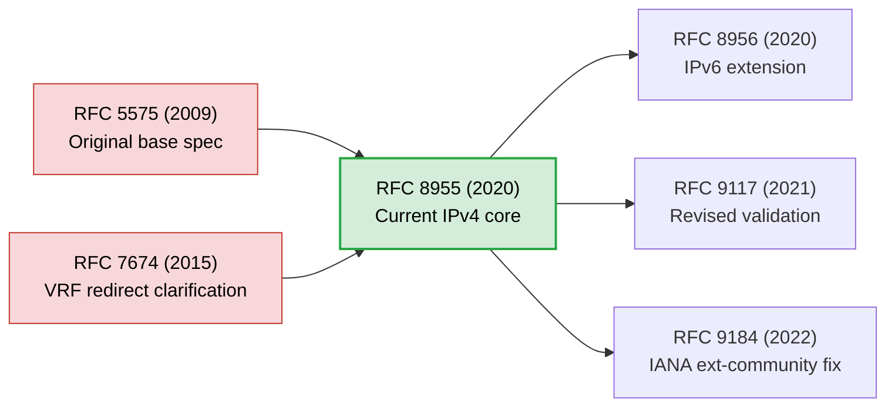
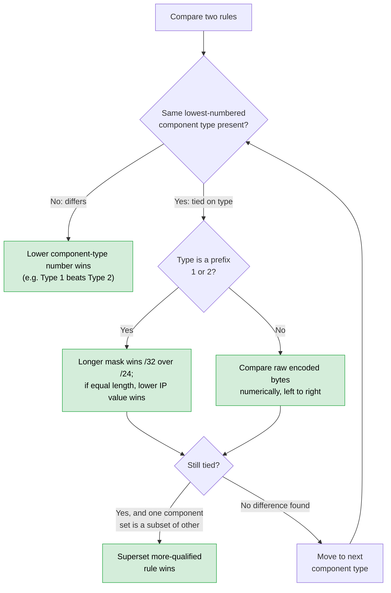
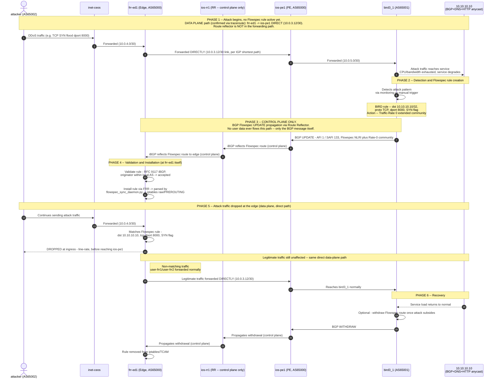

# BGP Flow Specification (Flowspec)

> 💡 **TL;DR:** Flowspec is an SDN-like BGP extension (AFI/SAFI **1/133** for IPv4) that distributes n-tuple match-and-action rules — not routes — so routers compile them straight into hardware TCAM as line-rate ACLs. **RFC 8955** is the current core standard. Unlike unicast BGP, there's no single "best path": every valid rule installs, ordered by a **deterministic sort** every router computes identically, so the same packet is always evaluated the same way network-wide.

---

### Overview

- **Model:** a policy generator (controller, RR, or a router like BIRD) pushes rules via BGP; clients (routers) enforce them in hardware — no manual CLI push per box.
- **Core unit:** a flow spec = an n-tuple of match **components** + an **action** (extended community). At least one component is required; none is individually mandatory.

---

### RFC Evolution



| RFC | Role |
|---|---|
| **8955** | Current IPv4 core standard; obsoletes 5575 and 7674 |
| **8956** | IPv6 extension (adds Flow Label, Header Chain Offset) |
| **9117** | Lets iBGP controllers/route-reflectors *outside* the forwarding path originate rules; fixes AS_PATH validation for eBGP route-server peers |
| **9184** | Reclassifies ext-community types `0x80–0x82` from experimental to IANA-standard |

> ⚠️ **Correction:** RFC 9117 isn't just "a minor iBGP tweak" — it's the reason centralized DDoS-scrubbing controllers work at all. The original RFC 5575 rule required the Flowspec-originating peer to be the *same* peer giving you the best unicast path — which a centralized controller never is. Without 9117, SDN-style Flowspec controllers would be structurally impossible.

---

### AFI / SAFI

| Flowspec Type | AFI | SAFI |
|---|---|---|
| IPv4 | 1 | 133 |
| IPv6 | 2 | 133 |
| VPN (L3VPN) | 1 or 2 | 134 |

---

### NLRI Match Components (RFC 8955)

| Type | Component | Encoding |
|---|---|---|
| 1 | Destination Prefix | Length + octets |
| 2 | Source Prefix | Length + octets |
| 3 | IP Protocol | Operator + proto # (6=TCP, 17=UDP) |
| 4 | Port (src **or** dst) | Operator + port |
| 5 | Destination Port | Operator + port |
| 6 | Source Port | Operator + port |
| 7 | ICMP Type | Operator + value |
| 8 | ICMP Code | Operator + value |
| 9 | TCP Flags | Bitmask operator + flag mask |
| 10 | Packet Length | Operator + L3 length |
| 11 | DSCP / ToS | Operator + 6-bit value |
| 12 | Fragment | Bitmask operator + DF/Is-Frag/First/Last |

### Operator Byte

| Style | Types | Layout | Meaning |
|---|---|---|---|
| **Numeric** | 3–8, 10, 11 | `e a len len g l e q` | e=end-of-list, a=AND(1)/OR(0), len=value size (`00`=1B `01`=2B `10`=4B), g/l/e=greater/less/equal, q=negate |
| **Bitmask** | 9, 12 | `e a len len 0 0 n m` | same e/a/len, then n=match-if-clear, m=match-if-set |

> ⚠️ **Correction:** The `q` (negate) bit is easy to skip past, but it's what makes `!=` expressible at all — Flowspec has no dedicated "not equal" opcode; it's built by inverting `e` with `q`.

---

### Actions (BGP Extended Communities)

| Sub-Type | Action | Encoding |
|---|---|---|
| `0x06` | Traffic-Rate | 2B ASN + 4B IEEE float (bytes/sec); **rate 0 = drop** |
| `0x07` | Traffic-Action | 6B bitmask — bit 47 = terminal (stop further rules), bit 46 = sample/mirror |
| `0x08` | Redirect to VRF | 6B Route Target |
| `0x09` | Traffic-Marking | 1B DSCP value + 5B padding |
| `0x0B` | Redirect to IP | 4B IPv4 address + 2B flags |

> ⚠️ **Correction:** "Traffic-Rate 0" is the de facto drop action — there's no explicit `0x00 = DROP` sub-type. This is also the exact lever that turns a Flowspec session into a blackholing (RTBH) mechanism, which is why control-plane route-maps should explicitly police (or deny) rate-0 announcements from untrusted peers.

---

### Rule Ordering — Deterministic Compilation

Flowspec has no single "best path." **Every valid rule installs into TCAM**, and every router computes the *same* relative order independently, from the raw NLRI bytes alone — never from BGP arrival time or path attributes.



1. **Component type** (lowest wins) — walk Type 1 upward; first type present in one rule but not the other decides it.
2. **Prefix specificity** (Types 1–2) — longer mask wins; equal length falls back to lower numeric address.
3. **Byte-string compare** (Types 3–12) — raw encoded value, numeric, left-to-right; lower wins.
4. **Subset tie-break** — only reached if everything else ties: the rule that is a strict superset of the other's components wins.

> ⚠️ **Correction:** It's tempting to read this as "most specific prefix wins overall," but specificity is only checked *after* component-type precedence is settled. A rule matching only on Destination Prefix (Type 1) always outranks a rule matching Source Prefix + Protocol + Port (Types 2, 3, 6) — even though the second rule is arguably "more specific" in a plain-English sense. The algorithm cares about type-number order first, qualification second.

---

### Security Validation

| Mode | Rule |
|---|---|
| **Control plane** (both) | Route-maps filter Flowspec NLRIs/communities — e.g. deny inbound `Traffic-Rate 0` from untrusted peers to block blackhole hijacking |
| **RFC 8955 (eBGP / strict)** | Destination prefix must exist in Loc-RIB, **and** the Flowspec peer must be the *same* peer providing the best unicast path to it |
| **RFC 9117 (iBGP / controller)** | Peer-alignment requirement relaxed — any originator inside the local AS validates; also fixes AS_PATH checks for eBGP peers acting as route servers |

---

### Quick Reference

- Current standard: **RFC 8955** (IPv4) / **RFC 8956** (IPv6); validation relaxation: **RFC 9117**
- 12 component types, ordered low-to-high by type, then specificity, then subset
- 5 actions: rate-limit, traffic-action (terminal/sample), VRF redirect, DSCP mark, IP redirect
- **Golden rule:** all valid rules go to hardware — there is no single "best path" like unicast BGP
## Let's Start Lab


**Before flowspec config**

bird3-1 op:-

```log
bird> show protocols all to_pe1
Name       Proto      Table      State  Since         Info
to_pe1     BGP        ---        up     15:02:35.384  Established
  Created:            15:02:20.301
  BGP state:          Established
    Neighbor address: 10.0.5.1
    Neighbor AS:      65000
    Local AS:         65001
    Neighbor ID:      10.0.1.5
    Local capabilities
      Multiprotocol
        AF announced: ipv4 flow4    <<<< Address Family
      Route refresh
      Graceful restart
        Restart time: 120
        AF supported: ipv4 flow4
        AF preserved:
      4-octet AS numbers
      Enhanced refresh
      Long-lived graceful restart
    Neighbor capabilities
      Multiprotocol
        AF announced: flow4 ipv4
      Route refresh
      4-octet AS numbers
      Enhanced refresh
    Session:          external AS4
    Source address:   10.0.5.2
    Hold timer:       23.734/30
    Keepalive timer:  4.428/10
    TX pending:       0 bytes
    Send hold timer:  52.249/60
  Channel ipv4
    State:          UP
    Import state:   UP
    Export state:   READY
    Table:          master4
    Preference:     100
    Input filter:   REJECT
    Output filter:  export_to_pe
    Routes:         0 imported, 2 exported, 0 preferred
    Route change stats:     received   rejected   filtered    ignored   RX limit      limit   accepted
      Import updates:              3          0          3          0          0          0          0
      Import withdraws:            0          0        ---          3        ---        ---          0
      Export updates:              2          0          0          0        ---          0          2
      Export withdraws:            0        ---        ---          0        ---        ---          0
    BGP Next hop:   10.0.5.2
    Pending 0 attribute sets with total 0 prefixes to send
  Channel flow4
    State:          UP
    Import state:   UP
    Export state:   READY
    Table:          flowtab4
    Preference:     100
    Input filter:   REJECT
    Output filter:  REJECT
    Routes:         0 imported, 0 exported, 0 preferred
    Route change stats:     received   rejected   filtered    ignored   RX limit      limit   accepted
      Import updates:              0          0          0          0          0          0          0
      Import withdraws:            0          0        ---          0        ---        ---          0
      Export updates:              2          0          2          0        ---          0          0
      Export withdraws:            0        ---        ---          0        ---        ---          0
    BGP Next hop:   10.0.5.2
    Pending 0 attribute sets with total 0 prefixes to send

bird> show route  table  all
Table master4:
10.10.10.10/32       unicast [direct1 15:02:20.302] * (240)
        dev any0
11.11.11.11/32       unicast [direct1 15:02:20.302] * (240)
        dev any0

Table master6:

bird> show  route export to_pe1 all
Table master4:
10.10.10.10/32       unicast [direct1 15:02:20.302] * (240)
        dev any0
        preference: 240
        source: device
        bgp_community: (65001,120) (65001,1001)
        Internal route handling values: 3L 5G 0S id 1
11.11.11.11/32       unicast [direct1 15:02:20.302] * (240)
        dev any0
        preference: 240
        source: device
        bgp_community: (65001,1001)
        Internal route handling values: 3L 5G 0S id 2
```

ios-pe1 op:-

```log
ios-pe1#show ip bgp summary
BGP router identifier 10.0.1.5, local AS number 65000
BGP table version is 9, main routing table version 9
5 network entries using 1240 bytes of memory
10 path entries using 1360 bytes of memory
8/5 BGP path/bestpath attribute entries using 2368 bytes of memory
5 BGP rrinfo entries using 200 bytes of memory
4 BGP AS-PATH entries using 96 bytes of memory
5 BGP community entries using 120 bytes of memory
0 BGP route-map cache entries using 0 bytes of memory
0 BGP filter-list cache entries using 0 bytes of memory
BGP using 5384 total bytes of memory
BGP activity 5/0 prefixes, 10/0 paths, scan interval 60 secs
5 networks peaked at 15:02:44 Jul 29 2026 UTC (00:06:46.206 ago)

Neighbor        V           AS MsgRcvd MsgSent   TblVer  InQ OutQ Up/Down  State/PfxRcd
10.0.1.1        4        65000      14      13        9    0    0 00:06:44        3
10.0.1.2        4        65000      24      20        9    0    0 00:06:46        5
10.0.5.2        4        65001      52      49        9    0    0 00:06:54        2

ios-pe1#show ip bgp
BGP table version is 9, local router ID is 10.0.1.5
Status codes: s suppressed, d damped, h history, * valid, > best, i - internal,
              r RIB-failure, S Stale, m multipath, b backup-path, f RT-Filter,
              x best-external, a additional-path, c RIB-compressed,
              t secondary path, L long-lived-stale,
Origin codes: i - IGP, e - EGP, ? - incomplete
RPKI validation codes: V valid, I invalid, N Not found

     Network          Next Hop            Metric LocPrf Weight Path
 *bi  10.10.10.10/32   10.0.1.6                      120      0 65001 i
 *>                    10.0.5.2                      120      0 65001 i
 *bi  11.11.11.11/32   10.0.1.6                      100      0 65001 i
 *>                    10.0.5.2                               0 65001 i
 *>i  172.16.1.0/24    10.0.1.3                      120      0 65002 i
 * i                   10.0.1.3                      120      0 65002 i
 *>i  172.17.1.0/24    10.0.1.3                 0    100      0 65003 i
 * i                   10.0.1.3                 0    100      0 65003 i
 *>i  172.18.1.0/24    10.0.1.4                 0    100      0 65004 i
 * i                   10.0.1.4                 0    100      0 65004 i
```

```log
frr-ed1# show ip bgp
BGP table version is 8, local router ID is 10.0.1.3, vrf id 0
Default local pref 100, local AS 65000
Status codes:  s suppressed, d damped, h history, u unsorted, * valid, > best, = multipath,
               i internal, r RIB-failure, S Stale, R Removed
Nexthop codes: @NNN nexthop's vrf id, < announce-nh-self
Origin codes:  i - IGP, e - EGP, ? - incomplete
RPKI validation codes: V valid, I invalid, N Not found

     Network          Next Hop            Metric LocPrf Weight Path
 *>i 10.10.10.10/32   10.0.1.5                 0    120      0 65001 i
 * i                  10.0.1.6                      120      0 65001 i
 *>i 11.11.11.11/32   10.0.1.5                 0    100      0 65001 i
 * i                  10.0.1.6                      100      0 65001 i
 *>  172.16.1.0/24    10.0.4.2                      120      0 65002 i
 *>  172.17.1.0/24    10.0.6.2                 0             0 65003 i
 *>i 172.18.1.0/24    10.0.1.4                 0    100      0 65004 i
 *=i                  10.0.1.4                 0    100      0 65004 i

Displayed 5 routes and 8 total paths

frr-ed1# show ip bgp summary
IPv4 Unicast Summary:
BGP router identifier 10.0.1.3, local AS number 65000 VRF default vrf-id 0
BGP table version 8
RIB entries 9, using 1152 bytes of memory
Peers 4, using 66 KiB of memory
Peer groups 1, using 64 bytes of memory

Neighbor        V         AS   MsgRcvd   MsgSent   TblVer  InQ OutQ  Up/Down State/PfxRcd   PfxSnt Desc
10.0.1.1        4      65000        18        15        8    0    0 00:09:10            3        2 N/A
10.0.1.2        4      65000        28        24        8    0    0 00:09:10            3        2 N/A
10.0.4.2        4      65002        16        20        8    0    0 00:09:16            1        5 N/A
10.0.6.2        4      65003        16        24        8    0    0 00:09:29            1        5 N/A

Total number of neighbors 4
```

**flowspec config**

---
bird3 config:-

bird3 having bydefault master4 and master6 table, so we need to create flow4 table.

file:- `/etc/bird/bird.conf`

```c
log syslog all;
router id 10.0.5.2;
include "/etc/bird/flowspec.conf";
define SITE_COMM_PRIMARY = (65001, 120);   # High Priority
define SITE_COMM_BACKUP  = (65001, 80);    # Low Priority
define LOCAL_SITE_TAG    = (65001, 1001);  # I am Site A
define BLACKHOLE         = (65001, 666);  # Black-hole community

protocol device {}
protocol direct {
    ipv4;           
    interface "any0";
}
protocol kernel {
    ipv4 {          
          import none;  
          export none;  
    };
}
filter export_to_pe {
    if net = 10.10.10.10/32 then {
        bgp_community.add(SITE_COMM_PRIMARY);
        bgp_community.add(LOCAL_SITE_TAG);
        accept;
    }
    if net = 11.11.11.11/32 then {
        bgp_community.add(LOCAL_SITE_TAG);
        accept;
    }
    reject;
}
protocol bgp to_pe1 {
    local 10.0.5.2 as 65001;
    neighbor 10.0.5.1 as 65000;
    ipv4 { 
        import none; 
        export filter export_to_pe;
    };
    flow4 {
        table flowtab4;
        import none;
        export all;
    };
    hold time 30;
    graceful restart on;       # Enables the Graceful Restart extension
}
```
file:- `/etc/bird/flowspec.conf`

```c
flow4 table flowtab4;

# Static FlowSpec Rule
protocol static flow_mitigation {
    flow4 { table flowtab4; };

    # Rule 1: Drop DDOS UDP/53 traffic from Attacker to Target 10.10.10.10
    route flow4 {
        dst 10.10.10.10/32;   # Target DNS IP
        proto 17;             # UDP
        dport 53;             # DNS Port
        length 512..1500;
    } {
        # Set Traffic-Rate to 0 (DROP)
        bgp_ext_community.add((generic, 0x80060000, 0x00000000));
    };

    # Rule 2: Drop attacker IP (e.g., 172.16.1.5) targeting 10.10.10.10
    # route flow4 {
    #     src 172.18.1.2/32;    # Attacker 2
    #     dst 10.10.10.10/32;   # Target DNS IP
    #     proto 17;             # UDP
    #     dport 53;             # DNS Port
    # } {
    #     bgp_ext_community.add((generic, 0x80060000, 0x00000000));
    # };
    
    # Rule 3: Drop TCP syn-flood attack
    route flow4 {
        # Type 1 & Type 2: Destination and Source Subnets
        dst 10.10.10.10/32;     
        proto 6;                # Type 3: IP Protocol (TCP = 6)
        dport 8000;             # Type 5: Destination Port
        tcp flags 0x02/0x02;    # Type 9: TCP Flags (Matching SYN bit only: SYN=0x02, Mask=0x02)
        length 40..54;
    } {
        # Set Traffic-Rate to 0 (DROP)
        bgp_ext_community.add((generic, 0x80060000, 0x00000000));
    };
}
```

ios-pe1 cfg:-

```sh
ios-pe1#show run | sec bgp
router bgp 65000
 template peer-policy rr-srv
  route-map to-rr out
  send-community both
 exit-peer-policy
 !
 template peer-session rr-srv
  remote-as 65000
  update-source Loopback0
 exit-peer-session
 !
 bgp router-id 10.0.1.5
 bgp log-neighbor-changes
 no bgp default ipv4-unicast
 neighbor 10.0.1.1 inherit peer-session rr-srv
 neighbor 10.0.1.2 inherit peer-session rr-srv
 neighbor 10.0.5.2 remote-as 65001
 !
 address-family ipv4
  bgp additional-paths install
  neighbor 10.0.1.1 activate
  neighbor 10.0.1.1 inherit peer-policy rr-srv
  neighbor 10.0.1.2 activate
  neighbor 10.0.1.2 inherit peer-policy rr-srv
  neighbor 10.0.5.2 activate
  neighbor 10.0.5.2 route-map bird3-65001 in
 exit-address-family
 !
 address-family ipv4 flowspec
  neighbor 10.0.1.1 activate
  neighbor 10.0.1.1 send-community both
  neighbor 10.0.1.1 next-hop-self
  neighbor 10.0.1.2 activate
  neighbor 10.0.1.2 send-community both
  neighbor 10.0.1.2 next-hop-self
  neighbor 10.0.5.2 activate
 exit-address-family
ip bgp-community new-format
```

junos-pe1 cfg:-

```sh
root@junos-pe2> show configuration protocols bgp | display set
set protocols bgp group bird3-2 local-address 10.0.5.5
set protocols bgp group bird3-2 import bird3-65001
set protocols bgp group bird3-2 family inet unicast
set protocols bgp group bird3-2 family inet flow
set protocols bgp group bird3-2 peer-as 65001
set protocols bgp group bird3-2 local-as 65000
set protocols bgp group bird3-2 neighbor 10.0.5.6
set protocols bgp group rr-srv local-address 10.0.1.6
set protocols bgp group rr-srv family inet unicast
set protocols bgp group rr-srv family inet flow
set protocols bgp group rr-srv export to-ibgp
set protocols bgp group rr-srv peer-as 65000
set protocols bgp group rr-srv local-as 65000
set protocols bgp group rr-srv neighbor 10.0.1.1
set protocols bgp group rr-srv neighbor 10.0.1.2
set protocols bgp bgp-identifier 10.0.1.6

root@junos-pe2> show configuration policy-options policy-statement to-ibgp | display set
set policy-options policy-statement to-ibgp term 0 from community bird3-65001-rtbh
set policy-options policy-statement to-ibgp term 0 then next-hop 192.0.2.1
set policy-options policy-statement to-ibgp term 0 then accept
set policy-options policy-statement to-ibgp term 1 from protocol bgp
set policy-options policy-statement to-ibgp term 1 then next-hop self
set policy-options policy-statement to-ibgp term 1 then accept
set policy-options policy-statement to-ibgp term 10 then reject
```

ios-rr1 cfg:-

```sh
ios-rr1#show run | sec bgp
router bgp 65000
 template peer-policy rr-client
  route-reflector-client
  soft-reconfiguration inbound
  send-community both
 exit-peer-policy
 !
 template peer-policy rr
  send-community both
 exit-peer-policy
 !
 template peer-session rr-client
  remote-as 65000
  update-source Loopback0
 exit-peer-session
 !
 template peer-session rr
  remote-as 65000
  update-source Loopback0
 exit-peer-session
 !
 bgp router-id 10.0.1.1
 bgp log-neighbor-changes
 no bgp default ipv4-unicast
 neighbor 10.0.1.2 inherit peer-session rr
 neighbor 10.0.1.3 inherit peer-session rr-client
 neighbor 10.0.1.4 inherit peer-session rr-client
 neighbor 10.0.1.5 inherit peer-session rr-client
 neighbor 10.0.1.6 inherit peer-session rr-client
 neighbor 10.0.1.7 inherit peer-session rr-client
 !
 address-family ipv4
  bgp additional-paths send receive
  bgp additional-paths install
  neighbor 10.0.1.2 activate
  neighbor 10.0.1.2 send-community both
  neighbor 10.0.1.2 inherit peer-policy rr
  neighbor 10.0.1.3 activate
  neighbor 10.0.1.3 inherit peer-policy rr-client
  neighbor 10.0.1.4 activate
  neighbor 10.0.1.4 inherit peer-policy rr-client
  neighbor 10.0.1.5 activate
  neighbor 10.0.1.5 inherit peer-policy rr-client
  neighbor 10.0.1.6 activate
  neighbor 10.0.1.6 inherit peer-policy rr-client
  neighbor 10.0.1.7 activate
  neighbor 10.0.1.7 inherit peer-policy rr-client
 exit-address-family
 !
 address-family ipv4 flowspec
  neighbor 10.0.1.2 activate
  neighbor 10.0.1.2 send-community both
  neighbor 10.0.1.2 inherit peer-policy rr
  neighbor 10.0.1.3 activate
  neighbor 10.0.1.3 inherit peer-policy rr-client
  neighbor 10.0.1.4 activate
  neighbor 10.0.1.4 inherit peer-policy rr-client
  neighbor 10.0.1.5 activate
  neighbor 10.0.1.5 inherit peer-policy rr-client
  neighbor 10.0.1.6 activate
  neighbor 10.0.1.6 inherit peer-policy rr-client
  neighbor 10.0.1.7 activate
  neighbor 10.0.1.7 inherit peer-policy rr-client
 exit-address-family
ip bgp-community new-format
```

junos-rr2 cfg:-

```sh
root@junos-rr2> show configuration protocols bgp | display set
set protocols bgp group rr-client local-address 10.0.1.2
set protocols bgp group rr-client family inet unicast
set protocols bgp group rr-client family inet flow
set protocols bgp group rr-client cluster 10.0.1.2
set protocols bgp group rr-client peer-as 65000
set protocols bgp group rr-client local-as 65000
set protocols bgp group rr-client neighbor 10.0.1.3
set protocols bgp group rr-client neighbor 10.0.1.4
set protocols bgp group rr-client neighbor 10.0.1.5
set protocols bgp group rr-client neighbor 10.0.1.6
set protocols bgp group rr-client neighbor 10.0.1.7
set protocols bgp group rr local-address 10.0.1.2
set protocols bgp group rr family inet unicast
set protocols bgp group rr family inet flow
set protocols bgp group rr peer-as 65000
set protocols bgp group rr local-as 65000
set protocols bgp group rr neighbor 10.0.1.1
set protocols bgp bgp-identifier 10.0.1.2
```

frr-ed1 cfg:-

```sh
hostname frr-ed1
!
ip prefix-list CEOS-65002 seq 5 permit 172.16.1.0/24
ip prefix-list FROM-65003 seq 5 permit 172.17.1.0/24
!
router bgp 65000
 bgp router-id 10.0.1.3
 no bgp ebgp-requires-policy
 no bgp default ipv4-unicast
 neighbor RR peer-group
 neighbor RR remote-as 65000
 neighbor RR update-source 10.0.1.3
 neighbor 10.0.1.1 peer-group RR
 neighbor 10.0.1.2 peer-group RR
 neighbor 10.0.4.2 remote-as 65002
 neighbor 10.0.6.2 remote-as 65003
 !
 address-family ipv4 unicast
  neighbor RR activate
  neighbor RR next-hop-self
  neighbor 10.0.4.2 activate
  neighbor 10.0.4.2 route-map CEOS-65002 in
  neighbor 10.0.6.2 activate
  neighbor 10.0.6.2 route-map FROM-65003 in
 exit-address-family
 !
 address-family ipv4 flowspec
  neighbor RR activate
 exit-address-family
exit
!
bgp as-path access-list 1 seq 5 permit ^65003$
!
bgp community-list standard CEOS-65002-1 seq 5 permit 65002:120
bgp community-list standard CEOS-65002-2 seq 5 permit 65002:90
!
route-map FROM-65003 permit 10
 match ip address prefix-list FROM-65003
exit
!
route-map CEOS-65002 permit 10
 match community CEOS-65002-1
 set local-preference 120
exit
!
route-map CEOS-65002 permit 20
 match community CEOS-65002-2
 set local-preference 90
exit
!
route-map CEOS-65002 permit 30
 match ip address prefix-list CEOS-65002
exit
!
end
```

frr-ed2 cfg:-

```sh
hostname frr-ed2
!
ip prefix-list CEOS-65002 seq 10 permit 172.16.1.0/24
ip prefix-list FROM-65004 seq 10 permit 172.18.1.0/24
!
router bgp 65000
 bgp router-id 10.0.1.4
 no bgp ebgp-requires-policy
 no bgp default ipv4-unicast
 neighbor RR peer-group
 neighbor RR remote-as 65000
 neighbor RR update-source 10.0.1.4
 neighbor 10.0.1.1 peer-group RR
 neighbor 10.0.1.2 peer-group RR
 neighbor 10.0.4.6 remote-as 65002
 neighbor 10.0.6.6 remote-as 65004
 !
 address-family ipv4 unicast
  neighbor RR activate
  neighbor RR next-hop-self
  neighbor 10.0.4.6 activate
  neighbor 10.0.4.6 route-map CEOS-65002-IN in
  neighbor 10.0.6.6 activate
  neighbor 10.0.6.6 route-map FROM-65004-IN in
 exit-address-family
 !
 address-family ipv4 flowspec
  neighbor RR activate
 exit-address-family
exit
!
bgp community-list standard CEOS-65002-1 seq 5 permit 65002:120
bgp community-list standard CEOS-65002-2 seq 5 permit 65002:90
!
route-map CEOS-65002-IN permit 10
 match community CEOS-65002-1
 set local-preference 120
exit
!
route-map CEOS-65002-IN permit 20
 match community CEOS-65002-2
 set local-preference 90
exit
!
route-map CEOS-65002-IN permit 30
 match ip address prefix-list CEOS-65002
exit
!
route-map FROM-65004-IN permit 10
 match ip address prefix-list FROM-65004
exit
!
route-map TO-IBGP permit 10
exit
!
end
```
---

***After configuration, validation steps***

bird3-1 op:-

```log
bird> show protocols to_pe1
Name       Proto      Table      State  Since         Info
to_pe1     BGP        ---        up     16:07:43.701  Established
bird> show protocols ?
show protocols [<protocol> | "<pattern>"]      Show routing protocols
show protocols all [<protocol> | "<pattern>"]  Show routing protocol details
bird> show protocols all to_pe1
Name       Proto      Table      State  Since         Info
to_pe1     BGP        ---        up     16:07:43.701  Established
  Created:            16:07:29.478
  BGP state:          Established
    Neighbor address: 10.0.5.1
    Neighbor AS:      65000
    Local AS:         65001
    Neighbor ID:      10.0.1.5
    Local capabilities
      Multiprotocol
        AF announced: ipv4 flow4
      Route refresh
      Graceful restart
        Restart time: 120
        AF supported: ipv4 flow4
        AF preserved:
      4-octet AS numbers
      Enhanced refresh
      Long-lived graceful restart
    Neighbor capabilities
      Multiprotocol
        AF announced: flow4 ipv4
      Route refresh
      4-octet AS numbers
      Enhanced refresh
    Session:          external AS4
    Source address:   10.0.5.2
    Hold timer:       22.727/30
    Keepalive timer:  2.625/10
    TX pending:       0 bytes
    Send hold timer:  39.504/60
  Channel ipv4
    State:          UP
    Import state:   UP
    Export state:   READY
    Table:          master4
    Preference:     100
    Input filter:   REJECT
    Output filter:  export_to_pe
    Routes:         0 imported, 2 exported, 0 preferred
    Route change stats:     received   rejected   filtered    ignored   RX limit      limit   accepted
      Import updates:              3          0          3          0          0          0          0
      Import withdraws:            0          0        ---          3        ---        ---          0
      Export updates:              2          0          0          0        ---          0          2
      Export withdraws:            0        ---        ---          0        ---        ---          0
    BGP Next hop:   10.0.5.2
    Pending 0 attribute sets with total 0 prefixes to send
  Channel flow4
    State:          UP
    Import state:   UP
    Export state:   READY
    Table:          flowtab4
    Preference:     100
    Input filter:   REJECT
    Output filter:  ACCEPT
    Routes:         0 imported, 2 exported, 0 preferred
    Route change stats:     received   rejected   filtered    ignored   RX limit      limit   accepted
      Import updates:              0          0          0          0          0          0          0
      Import withdraws:            0          0        ---          0        ---        ---          0
      Export updates:              2          0          0          0        ---          0          2
      Export withdraws:            0        ---        ---          0        ---        ---          0
    BGP Next hop:   10.0.5.2
    Pending 0 attribute sets with total 0 prefixes to send

bird> show route table all
Table flowtab4:
flow4 { dst 10.10.10.10/32; proto 17; dport 53; length 512..1500; } unknown [flow_mitigation 16:07:29.478] * (200)
flow4 { dst 10.10.10.10/32; proto 6; dport 8000; tcp flags 0x2/0x2; length 40..54; } unknown [flow_mitigation 16:07:29.478] * (200)

Table master4:
10.10.10.10/32       unicast [direct1 16:07:29.478] * (240)
        dev any0
11.11.11.11/32       unicast [direct1 16:07:29.478] * (240)
        dev any0

Table master6:

bird> show  route export to_pe1
Table master4:
10.10.10.10/32       unicast [direct1 16:07:29.478] * (240)
        dev any0
11.11.11.11/32       unicast [direct1 16:07:29.478] * (240)
        dev any0

Table flowtab4:
flow4 { dst 10.10.10.10/32; proto 17; dport 53; length 512..1500; } unknown [flow_mitigation 16:07:29.478] * (200)
flow4 { dst 10.10.10.10/32; proto 6; dport 8000; tcp flags 0x2/0x2; length 40..54; } unknown [flow_mitigation 16:07:29.478] * (200)

bird> show  route export to_pe1 all
Table master4:
10.10.10.10/32       unicast [direct1 16:07:29.478] * (240)
        dev any0
        preference: 240
        source: device
        bgp_community: (65001,120) (65001,1001)
        Internal route handling values: 6L 5G 0S id 1
11.11.11.11/32       unicast [direct1 16:07:29.478] * (240)
        dev any0
        preference: 240
        source: device
        bgp_community: (65001,1001)
        Internal route handling values: 6L 5G 0S id 2

Table flowtab4:
flow4 { dst 10.10.10.10/32; proto 17; dport 53; length 512..1500; } unknown [flow_mitigation 16:07:29.478] * (200)
        preference: 200
        source: static
        bgp_ext_community: (generic, 0x80060000, 0x0)
        Internal route handling values: 0L 3G 0S id 1
flow4 { dst 10.10.10.10/32; proto 6; dport 8000; tcp flags 0x2/0x2; length 40..54; } unknown [flow_mitigation 16:07:29.478] * (200)
        preference: 200
        source: static
        bgp_ext_community: (generic, 0x80060000, 0x0)
        Internal route handling values: 0L 3G 0S id 2
```

ios-ed1 op:-

```log
ios-pe1#show bgp ipv4 flowspec summary
BGP router identifier 10.0.1.5, local AS number 65000
BGP table version is 3, main routing table version 3
2 network entries using 16800 bytes of memory
4 path entries using 496 bytes of memory
2/1 BGP path/bestpath attribute entries using 592 bytes of memory
5 BGP rrinfo entries using 200 bytes of memory
4 BGP AS-PATH entries using 96 bytes of memory
5 BGP community entries using 120 bytes of memory
1 BGP extended community entries using 24 bytes of memory
0 BGP route-map cache entries using 0 bytes of memory
0 BGP filter-list cache entries using 0 bytes of memory
BGP using 18328 total bytes of memory
BGP activity 7/0 prefixes, 14/0 paths, scan interval 60 secs
2 networks peaked at 16:07:43 Jul 29 2026 UTC (00:15:11.945 ago)

Neighbor        V           AS MsgRcvd MsgSent   TblVer  InQ OutQ Up/Down  State/PfxRcd
10.0.1.1        4        65000      23      22        3    0    0 00:14:59        0
10.0.1.2        4        65000      42      37        3    0    0 00:15:02        2
10.0.5.2        4        65001     111     101        3    0    0 00:15:11        2


ios-pe1#show bgp ipv4 flowspec detail
BGP routing table entry for Dest:10.10.10.10/32,Proto:=6,DPort:=8000,TCPFlags:=0x02,Length:>=40&<=54, version 2
  Paths: (2 available, best #2, table IPv4-Flowspec-BGP-Table)
  Advertised to update-groups:
     2          3
  Refresh Epoch 1
  65001, (FS invalid: originator)
    0.0.0.0 from 10.0.1.2 (10.0.1.2)
      Origin IGP, localpref 100, valid, internal
      Extended Community: FLOWSPEC Traffic-rate:0,0
      Originator: 10.0.1.6, Cluster list: 10.0.1.2
      rx pathid: 0, tx pathid: 0
      Updated on Jul 29 2026 16:07:53 UTC
  Refresh Epoch 1
  65001
    0.0.0.0 from 10.0.5.2 (10.0.5.2)
      Origin IGP, localpref 100, valid, external, best
      Extended Community: FLOWSPEC Traffic-rate:0,0
      rx pathid: 0, tx pathid: 0x0
      Updated on Jul 29 2026 16:07:43 UTC
BGP routing table entry for Dest:10.10.10.10/32,Proto:=17,DPort:=53,Length:>=512&<=1500, version 3
  Paths: (2 available, best #2, table IPv4-Flowspec-BGP-Table)
  Advertised to update-groups:
     2          3
  Refresh Epoch 1
  65001, (FS invalid: originator)
    0.0.0.0 from 10.0.1.2 (10.0.1.2)
      Origin IGP, localpref 100, valid, internal
      Extended Community: FLOWSPEC Traffic-rate:0,0
      Originator: 10.0.1.6, Cluster list: 10.0.1.2
      rx pathid: 0, tx pathid: 0
      Updated on Jul 29 2026 16:07:53 UTC
  Refresh Epoch 1
  65001
    0.0.0.0 from 10.0.5.2 (10.0.5.2)
      Origin IGP, localpref 100, valid, external, best
      Extended Community: FLOWSPEC Traffic-rate:0,0
      rx pathid: 0, tx pathid: 0x0
      Updated on Jul 29 2026 16:07:43 UTC
```

```log
root@junos-pe2> show bgp summary
Threading mode: BGP I/O
Default eBGP mode: advertise - accept, receive - accept
Groups: 2 Peers: 3 Down peers: 0
Table          Tot Paths  Act Paths Suppressed    History Damp State    Pending
inet.0
                      10          5          0          0          0          0
inetflow.0
                       4          2          0          0          0          0
Peer                     AS      InPkt     OutPkt    OutQ   Flaps Last Up/Dwn State|#Active/Received/Accepted/Damped...
10.0.1.1              65000         44         42       0       0       16:34 Establ
  inet.0: 3/5/5/0
  inetflow.0: 0/2/2/0
10.0.1.2              65000         44         43       0       0       16:43 Establ
  inet.0: 0/3/3/0
  inetflow.0: 0/0/0/0
10.0.5.6              65001        121        118       0       0       16:51 Establ
  inet.0: 2/2/2/0
  inetflow.0: 2/2/2/0

root@junos-pe2> show route protocol bgp

inet.0: 33 destinations, 38 routes (33 active, 0 holddown, 0 hidden)
+ = Active Route, - = Last Active, * = Both

10.10.10.10/32     *[BGP/170] 00:17:58, localpref 120
                      AS path: 65001 I, validation-state: unverified
                    >  to 10.0.5.6 via eth4
                    [BGP/170] 00:16:38, MED 0, localpref 120, from 10.0.1.1
                      AS path: 65001 I, validation-state: unverified
                    >  to 10.0.3.9 via eth3
11.11.11.11/32     *[BGP/170] 00:17:58, localpref 100
                      AS path: 65001 I, validation-state: unverified
                    >  to 10.0.5.6 via eth4
                    [BGP/170] 00:16:38, MED 0, localpref 100, from 10.0.1.1
                      AS path: 65001 I, validation-state: unverified
                    >  to 10.0.3.9 via eth3
172.16.1.0/24      *[BGP/170] 00:16:38, localpref 120, from 10.0.1.1
                      AS path: 65002 I, validation-state: unverified
                       to 10.0.3.5 via eth1
                    >  to 10.0.3.9 via eth3
                    [BGP/170] 00:17:41, localpref 120, from 10.0.1.2
                      AS path: 65002 I, validation-state: unverified
                       to 10.0.3.5 via eth1
                    >  to 10.0.3.9 via eth3
172.17.1.0/24      *[BGP/170] 00:16:38, MED 0, localpref 100, from 10.0.1.1
                      AS path: 65003 I, validation-state: unverified
                       to 10.0.3.5 via eth1
                    >  to 10.0.3.9 via eth3
                    [BGP/170] 00:17:41, MED 0, localpref 100, from 10.0.1.2
                      AS path: 65003 I, validation-state: unverified
                       to 10.0.3.5 via eth1
                    >  to 10.0.3.9 via eth3
172.18.1.0/24      *[BGP/170] 00:16:38, MED 0, localpref 100, from 10.0.1.1
                      AS path: 65004 I, validation-state: unverified
                    >  to 10.0.3.5 via eth1
                    [BGP/170] 00:17:44, MED 0, localpref 100, from 10.0.1.2
                      AS path: 65004 I, validation-state: unverified
                    >  to 10.0.3.5 via eth1

inet6.0: 14 destinations, 15 routes (14 active, 0 holddown, 0 hidden)

inetflow.0: 2 destinations, 4 routes (2 active, 0 holddown, 2 hidden)
+ = Active Route, - = Last Active, * = Both

10.10.10.10,*,proto=6,dstport=8000,tcp-flag=02,len>=40&<=54/term:1
                   *[BGP/170] 00:17:58, localpref 100, from 10.0.5.6
                      AS path: 65001 I, validation-state: unverified
                       Fictitious
10.10.10.10,*,proto=17,dstport=53,len>=512&<=1500/term:2
                   *[BGP/170] 00:17:58, localpref 100, from 10.0.5.6
                      AS path: 65001 I, validation-state: unverified
                       Fictitious

root@junos-pe2> show route table inetflow.0 detail

inetflow.0: 2 destinations, 4 routes (2 active, 0 holddown, 2 hidden)
10.10.10.10,*,proto=6,dstport=8000,tcp-flag=02,len>=40&<=54/term:1 (2 entries, 1 announced)
        *BGP    Preference: 170/-101
                Next hop type: Fictitious, Next hop index: 0
                Address: 0xaaaab7cd447c
                Next-hop reference count: 4
                Kernel Table Id: 0
                Source: 10.0.5.6
                Next hop:
                State: <Active Ext SendNhToPFE>
                Peer AS: 65001
                Age: 18:31
                Validation State: unverified
                Task: BGP_65001_65000.10.0.5.6
                Announcement bits (2): 0-Flow 1-BGP_RT_Background
                AS path: 65001 I
                Communities: traffic-rate:0:0
                Accepted
                Validation state: Accept, Originator: 10.0.5.6, Nbr AS: 65001
                Via: 10.10.10.10/32, Active
                Localpref: 100
                Router ID: 10.0.5.6
                Thread: junos-main

10.10.10.10,*,proto=17,dstport=53,len>=512&<=1500/term:2 (2 entries, 1 announced)
        *BGP    Preference: 170/-101
                Next hop type: Fictitious, Next hop index: 0
                Address: 0xaaaab7cd447c
                Next-hop reference count: 4
                Kernel Table Id: 0
                Source: 10.0.5.6
                Next hop:
                State: <Active Ext SendNhToPFE>
                Peer AS: 65001
                Age: 18:31
                Validation State: unverified
                Task: BGP_65001_65000.10.0.5.6
                Announcement bits (2): 0-Flow 1-BGP_RT_Background
                AS path: 65001 I
                Communities: traffic-rate:0:0
                Accepted
                Validation state: Accept, Originator: 10.0.5.6, Nbr AS: 65001
                Via: 10.10.10.10/32, Active
                Localpref: 100
                Router ID: 10.0.5.6
                Thread: junos-main

root@junos-pe2> show route table inetflow.0 detail hidden

inetflow.0: 2 destinations, 4 routes (2 active, 0 holddown, 2 hidden)
10.10.10.10,*,proto=6,dstport=8000,tcp-flag=02,len>=40&<=54/term:1 (2 entries, 1 announced)
         BGP                 /-101
                Next hop type: Fictitious, Next hop index: 0
                Address: 0xaaaab7cd447c
                Next-hop reference count: 4
                Kernel Table Id: 0
                Source: 10.0.1.1
                Next hop:
                State: <Hidden Int Ext Changed SendNhToPFE>
                Inactive reason: Unusable path
                Peer AS: 65000
                Age: 17:08      Metric: 0
                Validation State: unverified
                Task: BGP_65000_65000.10.0.1.1
                AS path: 65001 I  (Originator)
                Cluster list:  10.0.1.1
                Originator ID: 10.0.1.5
                Communities: traffic-rate:0:0
                Accepted
                Validation state: Reject, Originator: 10.0.1.5, Nbr AS: 65001
                Via: 10.10.10.10/32, Active
                Localpref: 100
                Router ID: 10.0.1.1
                Hidden reason: Flow-route fails validation
                Thread: junos-main

10.10.10.10,*,proto=17,dstport=53,len>=512&<=1500/term:2 (2 entries, 1 announced)
         BGP                 /-101
                Next hop type: Fictitious, Next hop index: 0
                Address: 0xaaaab7cd447c
                Next-hop reference count: 4
                Kernel Table Id: 0
                Source: 10.0.1.1
                Next hop:
                State: <Hidden Int Ext Changed SendNhToPFE>
                Inactive reason: Unusable path
                Peer AS: 65000
                Age: 17:08      Metric: 0
                Validation State: unverified
                Task: BGP_65000_65000.10.0.1.1
                AS path: 65001 I  (Originator)
                Cluster list:  10.0.1.1
                Originator ID: 10.0.1.5
                Communities: traffic-rate:0:0
                Accepted
                Validation state: Reject, Originator: 10.0.1.5, Nbr AS: 65001
                Via: 10.10.10.10/32, Active
                Localpref: 100
                Router ID: 10.0.1.1
                Hidden reason: Flow-route fails validation
                Thread: junos-main
```

frr-ed1 op:-

```log
frr-ed1# show ip bgp summary

IPv4 Unicast Summary:
BGP router identifier 10.0.1.3, local AS number 65000 VRF default vrf-id 0
BGP table version 8
RIB entries 9, using 1152 bytes of memory
Peers 4, using 66 KiB of memory
Peer groups 1, using 64 bytes of memory

Neighbor        V         AS   MsgRcvd   MsgSent   TblVer  InQ OutQ  Up/Down State/PfxRcd   PfxSnt Desc
10.0.1.1        4      65000        30        26        8    0    0 00:20:02            3        2 N/A
10.0.1.2        4      65000        54        46        8    0    0 00:20:07            3        2 N/A
10.0.4.2        4      65002        28        31        8    0    0 00:20:09            1        5 N/A
10.0.6.2        4      65003        27        32        8    0    0 00:20:21            1        5 N/A

Total number of neighbors 4

IPv4 Flowspec Summary:
BGP router identifier 10.0.1.3, local AS number 65000 VRF default vrf-id 0
BGP table version 4
RIB entries 2, using 256 bytes of memory
Peers 2, using 33 KiB of memory
Peer groups 1, using 64 bytes of memory

Neighbor        V         AS   MsgRcvd   MsgSent   TblVer  InQ OutQ  Up/Down State/PfxRcd   PfxSnt Desc
10.0.1.1        4      65000        30        26        4    0    0 00:20:02            2        0 N/A
10.0.1.2        4      65000        54        46        4    0    0 00:20:07            2        0 N/A

Total number of neighbors 2

frr-ed1# show bgp ipv4 flowspec detail
BGP flowspec entry: (flags 0x418)
        Destination Address 10.10.10.10/32
        IP Protocol = 17
        Destination Port = 53
        Packet Length >= 512 , <= 1500
        FS:rate 0.000000
        received for 00:18:52
        not installed in PBR
BGP flowspec entry: (flags 0xc10)
        Destination Address 10.10.10.10/32
        IP Protocol = 17
        Destination Port = 53
        Packet Length >= 512 , <= 1500
        FS:rate 0.000000
        received for 00:20:43
        not installed in PBR
BGP flowspec entry: (flags 0x418)
        Destination Address 10.10.10.10/32
        IP Protocol = 6
        Destination Port = 8000
        TCP Flags = 2
        Packet Length >= 40 , <= 54
        FS:rate 0.000000
        received for 00:18:52
        not installed in PBR
BGP flowspec entry: (flags 0xc10)
        Destination Address 10.10.10.10/32
        IP Protocol = 6
        Destination Port = 8000
        TCP Flags = 2
        Packet Length >= 40 , <= 54
        FS:rate 0.000000
        received for 00:20:43
        not installed in PBR

Displayed 4 flowspec entries

frr-ed1# show pbr iptable
IPtable match0xffff898032c0 family IPv4 action drop (2)
         lookup dst port
         pkt len [512;1500]
         protocol 17
IPtable match0xffff89803260 family IPv4 action drop (1)
         lookup dst port
         pkt len [40;54]
         tcpflags [FIN,SYN,RST,PSH,ACK,URG/SYN]
         protocol 6

frr-ed1# show pbr ipset
IPset match0xffff898032c0 type net,port family IPv4
        to 10.10.10.10:proto 17:53 (2)

IPset match0xffff89803260 type net,port family IPv4
        to 10.10.10.10:proto 6:8000 (1)
```

frr-ed2 op:-

```log
frr-ed2# show ip bgp  summary

IPv4 Unicast Summary:
BGP router identifier 10.0.1.4, local AS number 65000 VRF default vrf-id 0
BGP table version 8
RIB entries 9, using 1152 bytes of memory
Peers 4, using 66 KiB of memory
Peer groups 1, using 64 bytes of memory

Neighbor        V         AS   MsgRcvd   MsgSent   TblVer  InQ OutQ  Up/Down State/PfxRcd   PfxSnt Desc
10.0.1.1        4      65000        32        26        8    0    0 00:21:56            4        1 N/A
10.0.1.2        4      65000        57        51        8    0    0 00:22:01            4        1 N/A
10.0.4.6        4      65002        30        33        8    0    0 00:22:03            1        5 N/A
10.0.6.6        4      65004        29        36        8    0    0 00:22:15            1        5 N/A

Total number of neighbors 4

IPv4 Flowspec Summary:
BGP router identifier 10.0.1.4, local AS number 65000 VRF default vrf-id 0
BGP table version 4
RIB entries 2, using 256 bytes of memory
Peers 2, using 33 KiB of memory
Peer groups 1, using 64 bytes of memory

Neighbor        V         AS   MsgRcvd   MsgSent   TblVer  InQ OutQ  Up/Down State/PfxRcd   PfxSnt Desc
10.0.1.1        4      65000        32        26        4    0    0 00:21:56            2        0 N/A
10.0.1.2        4      65000        57        51        4    0    0 00:22:01            2        0 N/A

Total number of neighbors 2

frr-ed2# show bgp ipv4 flowspec detail
BGP flowspec entry: (flags 0x418)
        Destination Address 10.10.10.10/32
        IP Protocol = 17
        Destination Port = 53
        Packet Length >= 512 , <= 1500
        FS:rate 0.000000
        received for 00:20:33
        not installed in PBR
BGP flowspec entry: (flags 0xc10)
        Destination Address 10.10.10.10/32
        IP Protocol = 17
        Destination Port = 53
        Packet Length >= 512 , <= 1500
        FS:rate 0.000000
        received for 00:22:25
        not installed in PBR
BGP flowspec entry: (flags 0x418)
        Destination Address 10.10.10.10/32
        IP Protocol = 6
        Destination Port = 8000
        TCP Flags = 2
        Packet Length >= 40 , <= 54
        FS:rate 0.000000
        received for 00:20:33
        not installed in PBR
BGP flowspec entry: (flags 0xc10)
        Destination Address 10.10.10.10/32
        IP Protocol = 6
        Destination Port = 8000
        TCP Flags = 2
        Packet Length >= 40 , <= 54
        FS:rate 0.000000
        received for 00:22:25
        not installed in PBR

Displayed 4 flowspec entries

frr-ed2# show pbr iptable
IPtable match0xffffad7a9f60 family IPv4 action drop (1)
         lookup dst port
         pkt len [40;54]
         tcpflags [FIN,SYN,RST,PSH,ACK,URG/SYN]
         protocol 6
IPtable match0xffffad7aa140 family IPv4 action drop (2)
         lookup dst port
         pkt len [512;1500]
         protocol 17

frr-ed2# show pbr ipset
IPset match0xffffad7aa140 type net,port family IPv4
        to 10.10.10.10:proto 17:53 (2)

IPset match0xffffad7a9f60 type net,port family IPv4
        to 10.10.10.10:proto 6:8000 (1)
```


> Note: lab devices are control-plane only (no line cards), so a Python script (`frr-flowspec-to-iptable.py`) runs on each FRR router, watches the BGP Flowspec table, and translates received rules into equivalent `iptables` raw-table rules to emulate hardware TCAM enforcement.

```sh
frr-ed1:~# ps aux | grep python3

   41 root      0:01 python3 /usr/local/bin/frr-flowspec-to-iptable.py

frr-ed1:~# iptables -t raw -L -v -n --line-number
Chain PREROUTING (policy ACCEPT 943 packets, 76338 bytes)
num   pkts bytes target     prot opt in     out     source               destination
1      943 76338 BGP_FLOWSPEC  all  --  *      *       0.0.0.0/0            0.0.0.0/0

Chain OUTPUT (policy ACCEPT 0 packets, 0 bytes)
num   pkts bytes target     prot opt in     out     source               destination

Chain BGP_FLOWSPEC (1 references)
num   pkts bytes target     prot opt in     out     source               destination
1        0     0 DROP       udp  --  *      *       0.0.0.0/0            10.10.10.10          udp dpt:53 length 512:1500 /* fs_08ab075186cd */
2        0     0 DROP       tcp  --  *      *       0.0.0.0/0            10.10.10.10          tcp dpt:8000 flags:0x17/0x02 length 40:54 /* fs_41509cf38bf5 */
```

> Attacker's best path to 10.10.10.10 (bird3-1) transits frr-ed1, so attack traffic must cross it before reaching the target — run tcpdump on bird3-1 and watch the iptables counters on frr-ed1 to confirm the rules match and filter.

1. Legitmate packet send from attacker machine to bird3-1

```log
attacker:~# curl -v http://10.10.10.10:8000

*   Trying 10.10.10.10:8000...
* Established connection to 10.10.10.10 (10.10.10.10 port 8000) from 172.16.1.2 port 46096
* using HTTP/1.x
> GET / HTTP/1.1
> Host: 10.10.10.10:8000
> User-Agent: curl/8.21.0
> Accept: */*
>
* Request completely sent off
* HTTP 1.0, assume close after body
< HTTP/1.0 200 OK
< Server: SimpleHTTP/0.6 Python/3.13.5
< Date: Wed, 29 Jul 2026 16:40:15 GMT
< Content-type: text/html; charset=utf-8
< Content-Length: 840
<
<!DOCTYPE HTML>
<html lang="en">
<head>
<meta charset="utf-8">
<title>Directory listing for /</title>
</head>
<body>
<h1>Directory listing for /</h1>
<hr>
<ul>
<li><a href=".dockerenv">.dockerenv</a></li>
<li><a href="bin/">bin@</a></li>
<li><a href="boot/">boot/</a></li>
<li><a href="dev/">dev/</a></li>
<li><a href="etc/">etc/</a></li>
<li><a href="home/">home/</a></li>
<li><a href="lib/">lib@</a></li>
<li><a href="media/">media/</a></li>
<li><a href="mnt/">mnt/</a></li>
<li><a href="opt/">opt/</a></li>
<li><a href="proc/">proc/</a></li>
<li><a href="root/">root/</a></li>
<li><a href="run/">run/</a></li>
<li><a href="sbin/">sbin@</a></li>
<li><a href="srv/">srv/</a></li>
<li><a href="sys/">sys/</a></li>
<li><a href="tmp/">tmp/</a></li>
<li><a href="usr/">usr/</a></li>
<li><a href="var/">var/</a></li>
</ul>
<hr>
</body>
</html>
* shutting down connection #0

attacker:~# dig anycast.eptstech.arpa @10.10.10.10

; <<>> DiG 9.20.23 <<>> anycast.eptstech.arpa @10.10.10.10
;; global options: +cmd
;; Got answer:
;; ->>HEADER<<- opcode: QUERY, status: NOERROR, id: 37659
;; flags: qr aa rd ra; QUERY: 1, ANSWER: 1, AUTHORITY: 0, ADDITIONAL: 1

;; OPT PSEUDOSECTION:
; EDNS: version: 0, flags:; udp: 1232
;; QUESTION SECTION:
;anycast.eptstech.arpa.         IN      A

;; ANSWER SECTION:
anycast.eptstech.arpa.  0       IN      A       10.10.10.10

;; Query time: 2 msec
;; SERVER: 10.10.10.10#53(10.10.10.10) (UDP)
;; WHEN: Wed Jul 29 16:41:49 UTC 2026
;; MSG SIZE  rcvd: 66
```

```log
root@bird3-1:~# tcpdump -nni eth1 host 172.16.1.2
tcpdump: verbose output suppressed, use -v[v]... for full protocol decode
listening on eth1, link-type EN10MB (Ethernet), snapshot length 262144 bytes
16:40:15.289319 IP 172.16.1.2.46096 > 10.10.10.10.8000: Flags [S], seq 3956757090, win 64240, options [mss 1460,sackOK,TS val 2549865351 ecr 0,nop,wscale 10], length 0
16:40:15.289340 IP 10.10.10.10.8000 > 172.16.1.2.46096: Flags [S.], seq 2748835958, ack 3956757091, win 65160, options [mss 1460,sackOK,TS val 3402847741 ecr 2549865351,nop,wscale 10], length 0
16:40:15.289926 IP 172.16.1.2.46096 > 10.10.10.10.8000: Flags [.], ack 1, win 63, options [nop,nop,TS val 2549865366 ecr 3402847741], length 0
16:40:15.290809 IP 172.16.1.2.46096 > 10.10.10.10.8000: Flags [P.], seq 1:81, ack 1, win 63, options [nop,nop,TS val 2549865366 ecr 3402847741], length 80
16:40:15.290814 IP 10.10.10.10.8000 > 172.16.1.2.46096: Flags [.], ack 81, win 64, options [nop,nop,TS val 3402847743 ecr 2549865366], length 0
16:40:15.295926 IP 10.10.10.10.8000 > 172.16.1.2.46096: Flags [P.], seq 1:156, ack 81, win 64, options [nop,nop,TS val 3402847748 ecr 2549865366], length 155
16:40:15.296003 IP 10.10.10.10.8000 > 172.16.1.2.46096: Flags [FP.], seq 156:996, ack 81, win 64, options [nop,nop,TS val 3402847748 ecr 2549865366], length 840
16:40:15.296512 IP 172.16.1.2.46096 > 10.10.10.10.8000: Flags [.], ack 156, win 63, options [nop,nop,TS val 2549865372 ecr 3402847748], length 0
16:40:15.297072 IP 172.16.1.2.46096 > 10.10.10.10.8000: Flags [.], ack 997, win 63, options [nop,nop,TS val 2549865373 ecr 3402847748], length 0
16:40:15.297173 IP 172.16.1.2.46096 > 10.10.10.10.8000: Flags [F.], seq 81, ack 997, win 63, options [nop,nop,TS val 2549865373 ecr 3402847748], length 0
16:40:15.297180 IP 10.10.10.10.8000 > 172.16.1.2.46096: Flags [.], ack 82, win 64, options [nop,nop,TS val 3402847749 ecr 2549865373], length 0
16:41:49.060223 IP 172.16.1.2.50784 > 10.10.10.10.53: 37659+ [1au] A? anycast.eptstech.arpa. (62)
16:41:49.060342 IP 10.10.10.10.53 > 172.16.1.2.50784: 37659* 1/0/1 A 10.10.10.10 (66)
```

```log
frr-ed1:~# iptables -t raw -L -v -n --line-number
Chain PREROUTING (policy ACCEPT 1199 packets, 97401 bytes)
num   pkts bytes target     prot opt in     out     source               destination
1     1199 97401 BGP_FLOWSPEC  all  --  *      *       0.0.0.0/0            0.0.0.0/0

Chain OUTPUT (policy ACCEPT 0 packets, 0 bytes)
num   pkts bytes target     prot opt in     out     source               destination

Chain BGP_FLOWSPEC (1 references)
num   pkts bytes target     prot opt in     out     source               destination
1        0     0 DROP       udp  --  *      *       0.0.0.0/0            10.10.10.10          udp dpt:53 length 512:1500 /* fs_08ab075186cd */
2        0     0 DROP       tcp  --  *      *       0.0.0.0/0            10.10.10.10          tcp dpt:8000 flags:0x17/0x02 length 40:54 /* fs_41509cf38bf5 */
```

2. Start the attack by using scapy

```sh
attacker:~# scapy

INFO: Can't import PyX. Won't be able to use psdump() or pdfdump().
INFO: Can't import python-cryptography v2.0+. Disabled PKI & TLS crypto-related features.
INFO: Can't import python-cryptography v2.0+. Disabled WEP decryption/encryption. (Dot11)
INFO: Can't import python-cryptography v2.0+. Disabled IPsec encryption/authentication.
WARNING: No alternative Python interpreters found ! Using standard Python shell instead.
INFO: Using the default Python shell: History is disabled.

                     aSPY//YASa
             apyyyyCY//////////YCa       |
            sY//////YSpcs  scpCY//Pp     | Welcome to Scapy
 ayp ayyyyyyySCP//Pp           syY//C    | Version 2.7.0
 AYAsAYYYYYYYY///Ps              cY//S   |
         pCCCCY//p          cSSps y//Y   | https://github.com/secdev/scapy
         SPPPP///a          pP///AC//Y   |
              A//A            cyP////C   | Have fun!
              p///Ac            sC///a   |
              P////YCpc           A//A   | Craft packets like it is your last
       scccccp///pSP///p          p//Y   | day on earth.
      sY/////////y  caa           S//P   |                      -- Lao-Tze
       cayCyayP//Ya              pY/Ya   |
        sY/PsY////YCc          aC//Yp
         sc  sccaCY//PCypaapyCP//YSs
                  spCPY//////YPSps
                       ccaacs

>>> pkt = IP(src="172.16.1.2", dst="10.10.10.10") / TCP(dport=8000, flags="S")
>>> send(pkt, loop=1, inter=0.1)
...................................................................................................................................................................................................^C
Sent 195 packets.
>>> pkt = IP(dst="10.10.10.10") / UDP(dport=53) / DNS(rd=1, qd=DNSQR(qname="ns1.eptstech.arpa")) / Raw(load="A"*620)
>>> send(pkt, loop=1, inter=0.05)
.......................................................................................................................................................................................................................................................................^C
Sent 263 packets.
```

bird3-1 op:-

- No pkt received bird3-1 server

```log
root@bird3-1:~# tcpdump -nni eth1 host 172.16.1.2

tcpdump: verbose output suppressed, use -v[v]... for full protocol decode
listening on eth1, link-type EN10MB (Ethernet), snapshot length 262144 bytes
^C
0 packets captured
0 packets received by filter
0 packets dropped by kernel
```

frr-ed1 iptable op:-

- all packets are getting drop by frr-ed1

```bash
frr-ed1:~# iptables -t raw -L -v -n --line-number
Chain PREROUTING (policy ACCEPT 1345 packets, 109K bytes)
num   pkts bytes target     prot opt in     out     source               destination
1     1803  296K BGP_FLOWSPEC  all  --  *      *       0.0.0.0/0            0.0.0.0/0

Chain OUTPUT (policy ACCEPT 0 packets, 0 bytes)
num   pkts bytes target     prot opt in     out     source               destination

Chain BGP_FLOWSPEC (1 references)
num   pkts bytes target     prot opt in     out     source               destination
1      263  180K DROP       udp  --  *      *       0.0.0.0/0            10.10.10.10          udp dpt:53 length 512:1500 /* fs_08ab075186cd */
2      195  7800 DROP       tcp  --  *      *       0.0.0.0/0            10.10.10.10          tcp dpt:8000 flags:0x17/0x02 length 40:54 /* fs_41509cf38bf5 */
```

>Flowspec packet flow according this lab


