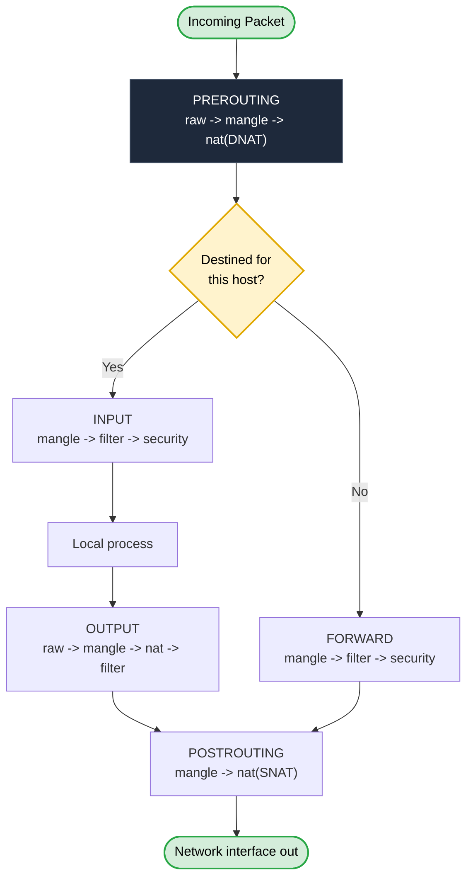
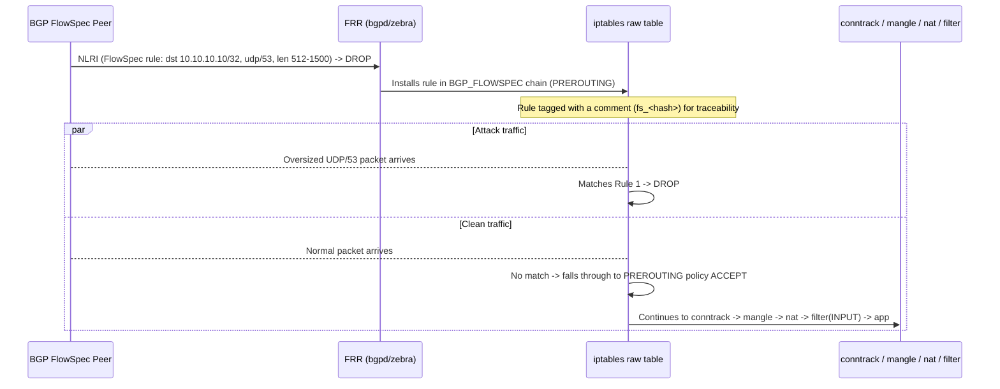
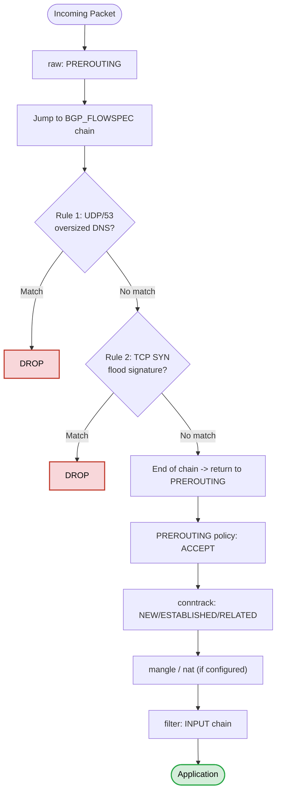

## iptables / Netfilter — Core Model & FRR BGP FlowSpec Integration

> 💡 **TL;DR:** `iptables` is a userspace tool that writes rules into the kernel's **Netfilter** framework. A packet is matched against **5 tables** (`raw → mangle → nat → filter → security`) inside **5 built-in chains** (`PREROUTING, INPUT, FORWARD, OUTPUT, POSTROUTING`), evaluated top-to-bottom, first-match-wins. For FRR + BGP FlowSpec, the `raw` table's `PREROUTING` chain is the important one — it runs **before conntrack**, so remote-triggered FlowSpec drops (RTBH-style DDoS mitigation) happen at the cheapest possible point, before the kernel spends any cycles tracking the connection.

---

### What iptables Actually Is

- **Netfilter** is the real packet-filtering engine, living in kernel space at fixed hook points in the network stack.
- **`iptables`** is just the userspace CLI that writes rules into Netfilter — it does no filtering itself.
- Rules are **stateless by default**; statefulness only comes from `-m state` / `-m conntrack`.
- Rules live **in memory only** — a reboot wipes them unless explicitly saved (`iptables-save`) and restored.
- On modern distros (RHEL 8+, Ubuntu 20.04+), the `iptables` command is usually a **compatibility shim** (`iptables-nft`) that translates into `nftables` rules under the hood. Older systems use the **legacy** backend that talks to Netfilter directly.

```bash
sudo iptables --version
# iptables v1.8.x (nf_tables)   <- nftables backend
# iptables v1.8.x (legacy)      <- legacy backend
```

---

### Tables (What Kind of Decision Is Being Made)

| Table | Purpose | Built-in Chains | Execution Stage |
|---|---|---|---|
| **`raw`** | Fast-path filtering; `NOTRACK` exemptions; **BGP FlowSpec / DDoS drops** | `PREROUTING`, `OUTPUT` | **Earliest — before conntrack** |
| **`mangle`** | Modify headers (TTL, TOS/DSCP), set `skb` marks for QoS | `PREROUTING`, `INPUT`, `FORWARD`, `OUTPUT`, `POSTROUTING` | Pre/post-routing & transit |
| **`nat`** | Rewrite src/dst addresses (SNAT/DNAT/MASQUERADE). *Only the first packet of a flow is evaluated — the rest follow via conntrack.* | `PREROUTING`, `INPUT`, `OUTPUT`, `POSTROUTING` | Routing hooks |
| **`filter`** *(default)* | Allow/deny/reject — general stateful firewalling | `INPUT`, `FORWARD`, `OUTPUT` | Standard routing |
| **`security`** | SELinux/MAC policy marking | `INPUT`, `FORWARD`, `OUTPUT` | Post-filter security |

> ⚠️ **Correction:** The `raw` table isn't just "another table" — it's the **only** table that runs before connection tracking exists. That's precisely why it's the right place for BGP FlowSpec-driven drops: a volumetric attack flow never gets a conntrack entry allocated for it at all, which is what makes raw-table drops so much cheaper than an equivalent `filter`/`INPUT` rule under load.

### Chains

- **Built-in chains** map 1:1 to kernel hook points: `PREROUTING` (just arrived, pre-routing-decision) → `INPUT` (destined for this host) / `FORWARD` (passing through) → `OUTPUT` (generated by this host) → `POSTROUTING` (about to leave the interface).
- **User-defined chains** are custom, `-j`-referenced sub-chains for organization — e.g. a `BGP_FLOWSPEC` chain jumped into from `PREROUTING`.
- Each rule = **match** + **target**. Rules evaluate **top to bottom**; first match wins (unless the target is non-terminating, like `LOG`).

**Rule of thumb:**
- Traffic **to** this host → `INPUT`
- Traffic **from** this host → `OUTPUT`
- Traffic **through** this host (router/VPN/Docker) → `FORWARD`
- NAT happens in `PREROUTING` (DNAT, before routing) and `POSTROUTING` (SNAT/MASQUERADE, after routing)

---

### Packet Flow Through Netfilter



> ⚠️ **Correction:** A common mix-up is treating `filter`/`INPUT` as "the firewall" and forgetting `raw` runs first. If a rule is dropped in `raw PREROUTING`, it **never reaches** `mangle`, `nat`, `filter`, or conntrack — this is exactly the behavior BGP FlowSpec drop rules rely on.

---

### Basic Syntax & Rule-Spec

```bash
iptables [-t table] COMMAND CHAIN RULE-SPEC [-j TARGET]
```

| Command | Meaning |
|---|---|
| `-A` | Append rule to end of chain |
| `-I` | Insert at a position (default: top) |
| `-D` | Delete a specific rule |
| `-L` / `-S` | List rules (human-readable / as executable commands) |
| `-F` | Flush all rules in a chain |
| `-N` / `-X` | Create / delete a user-defined chain |
| `-P` | Set default policy for a built-in chain |
| `-C` | Check if a rule already exists (idempotent scripting) |

| Rule-spec flag | Meaning |
|---|---|
| `-p` | Protocol: tcp, udp, icmp, all |
| `-s` / `-d` | Source / destination IP or subnet |
| `-i` / `-o` | Input / output interface |
| `--sport` / `--dport` | Source / destination port |
| `-j` | Jump to target |
| `!` | Negation |

Always use `iptables -L -n -v` in production — plain `-L` triggers a reverse-DNS lookup per rule and can hang if DNS is unreachable.

---

### Key Matches

| Match | Use |
|---|---|
| `-m conntrack --ctstate NEW,ESTABLISHED,RELATED,INVALID` | Stateful matching — the single most important match for any host firewall |
| `-m multiport --dports 80,443,8080:8090` | Multiple ports in one rule |
| `-m limit` / `-m recent` | Rate limiting, brute-force defense |
| `-m length --length 512:1500` | Match on packet length — used heavily in FlowSpec-style drops (e.g. oversized UDP/DNS) |
| `-m set --match-set blacklist src` | Match against an `ipset` (O(1)-ish lookups vs linear `-s` rules) |
| `-m string` | Match payload content |
| `-m iprange` | Arbitrary IP ranges, not just CIDR |

### Targets

| Target | Behavior |
|---|---|
| `ACCEPT` | Allow through |
| `DROP` | Silently discard — attacker can't tell filtered vs closed |
| `REJECT` | Discard + send ICMP/TCP error back — politer, but reveals the host is alive |
| `LOG` | Log then **continue** (non-terminating) — always pair with a following `DROP`/`ACCEPT` |
| `SNAT` / `DNAT` / `MASQUERADE` | Rewrite source / destination / dynamic-source address (nat table only) |
| `RETURN` | Stop this chain, fall back to the calling chain |

---

### Connection Tracking (conntrack)

`nf_conntrack` tracks every connection's state, which is what lets a rule say "allow established traffic" instead of manually opening every ephemeral return port.

```bash
iptables -A INPUT -m conntrack --ctstate ESTABLISHED,RELATED -j ACCEPT
iptables -A INPUT -m conntrack --ctstate INVALID -j DROP
```

This pair belongs near the **top** of `INPUT` so return traffic isn't re-evaluated against every later rule.

> ⚠️ **Correction:** conntrack only exists **after** the `raw` table. Rules in `raw` (like FlowSpec drops) are matched against the raw packet with **zero conntrack state** — there's no `NEW`/`ESTABLISHED` concept available at that point yet.

---

### NAT Quick Reference (`nat` table)

```bash
# SNAT — static public IP
iptables -t nat -A POSTROUTING -s 10.0.0.0/24 -o eth0 -j SNAT --to-source 203.0.113.10

# MASQUERADE — dynamic WAN IP (DHCP/PPPoE)
iptables -t nat -A POSTROUTING -s 10.0.0.0/24 -o eth0 -j MASQUERADE

# DNAT — inbound port forwarding
iptables -t nat -A PREROUTING -p tcp -d 203.0.113.10 --dport 8080 -j DNAT --to-destination 10.0.0.5:80

sysctl -w net.ipv4.ip_forward=1   # required for any router/NAT box
```

---

## Raw Table Deep Dive — BGP FlowSpec on FRR

This is where BGP FlowSpec-triggered ACLs land on a Linux/FRR router: routes received via the FlowSpec AFI/SAFI get translated by FRR's `zebra`/`bgpd` dataplane hook into **raw-table PREROUTING rules**, so drops happen before routing, conntrack, NAT, or the filter table ever see the packet.



### Which Table Contains Which Chain — FlowSpec Context

| Table | Chains | Role in FlowSpec Deployment |
|---|---|---|
| `raw` | `PREROUTING`, `OUTPUT` | **FlowSpec drop rules live here** — earliest possible, pre-conntrack |
| `mangle` | all 5 | Not typically touched by FlowSpec; available for DSCP/marking if needed |
| `nat` | `PREROUTING/INPUT/OUTPUT/POSTROUTING` | Untouched by FlowSpec rules |
| `filter` | `INPUT/FORWARD/OUTPUT` | Standard stateful firewall — still runs *after* raw for anything not dropped |

### Sample FRR / iptables Raw-Table Output

```log
> iptables -t raw -S

-P PREROUTING ACCEPT
-P OUTPUT ACCEPT
-N BGP_FLOWSPEC
-A PREROUTING -j BGP_FLOWSPEC
-A BGP_FLOWSPEC -d 10.10.10.10/32 -p udp -m udp --dport 53 -m length --length 512:1500 -m comment --comment fs_08ab075186cd -j DROP
-A BGP_FLOWSPEC -d 10.10.10.10/32 -p tcp -m tcp --dport 8000 --tcp-flags FIN,SYN,RST,ACK SYN -m length --length 40:54 -m comment --comment fs_41509cf38bf5 -j DROP

> iptables -t raw -L -v -n --line-number

Chain PREROUTING (policy ACCEPT 864 packets, 71412 bytes)
num   pkts bytes target        prot opt in     out     source               destination
1      864 71412 BGP_FLOWSPEC  all  --  *      *       0.0.0.0/0            0.0.0.0/0

Chain BGP_FLOWSPEC (1 references)
num   pkts bytes target     prot opt in     out     source               destination
1        0     0 DROP       udp  --  *      *       0.0.0.0/0            10.10.10.10          udp dpt:53 length 512:1500 /* fs_08ab075186cd */
2        0     0 DROP       tcp  --  *      *       0.0.0.0/0            10.10.10.10          tcp dpt:8000 flags:0x17/0x02 length 40:54 /* fs_41509cf38bf5 */
```

**Reading it:**
- Rule 1 in `BGP_FLOWSPEC` — drops oversized UDP/53 (large DNS responses, classic amplification signature).
- Rule 2 — drops TCP SYN-only packets to port 8000 in a narrow 40–54 byte length window (SYN-flood signature).
- The `/* fs_<hash> */` comment is FRR's marker tying the iptables rule back to the originating FlowSpec NLRI — useful for correlating `show bgp ipv4 flowspec` output with the live iptables rule.

### Traversal Path for a Clean (Non-Matching) Packet



1. Packet enters `raw PREROUTING`, jumps into `BGP_FLOWSPEC`.
2. Checked against Rule 1 (oversized UDP/DNS) — no match.
3. Checked against Rule 2 (TCP SYN-flood pattern) — no match.
4. End of chain reached without a `DROP` → control returns to `PREROUTING`.
5. `PREROUTING` policy is `ACCEPT` → packet exits the `raw` table entirely.
6. Continues through the standard pipeline: **conntrack** (assigns NEW/ESTABLISHED/RELATED) → **mangle/nat** (if configured) → **filter/INPUT** (stateful firewall) → application.

> ⚠️ **Correction:** It's easy to assume a FlowSpec drop rule "blocks the connection." What it actually does is drop the **packet** in `raw`, before a connection ever exists in conntrack — there's no connection to block yet. This is also why FlowSpec-style raw rules are stateless: each packet is evaluated independently against `-m length`/`--tcp-flags`/etc., not against a tracked flow.

---

### Useful Commands for the Raw / FlowSpec Table

```bash
iptables -t raw -L -v -n              # list raw table, numeric, with counters
iptables -t raw -S                    # list raw table as executable commands (verify FRR-injected rules)
iptables -t raw -A PREROUTING -p tcp --dport 443 -j TRACE   # trace a specific flow through the raw table
sudo journalctl -k -f | grep TRACE
```

---

### Building a Baseline Host Firewall (`filter` table, for context)

```bash
IPT="iptables"
$IPT -P INPUT DROP
$IPT -P FORWARD DROP
$IPT -P OUTPUT ACCEPT

$IPT -A INPUT -i lo -j ACCEPT
$IPT -A INPUT -m conntrack --ctstate ESTABLISHED,RELATED -j ACCEPT
$IPT -A INPUT -m conntrack --ctstate INVALID -j DROP

$IPT -A INPUT -p tcp --dport 22 -m conntrack --ctstate NEW -j ACCEPT
$IPT -A INPUT -p tcp --dport 80 -m conntrack --ctstate NEW -j ACCEPT
$IPT -A INPUT -p tcp --dport 443 -m conntrack --ctstate NEW -j ACCEPT

$IPT -A INPUT -p icmp --icmp-type echo-request -m limit --limit 1/s -j ACCEPT
$IPT -A INPUT -p tcp --tcp-flags ALL NONE -j DROP     # null scan
$IPT -A INPUT -p tcp --tcp-flags ALL ALL -j DROP      # XMAS scan
$IPT -A INPUT -f -j DROP                              # fragments

$IPT -A INPUT -m limit --limit 5/min -j LOG --log-prefix "IPT-DROP: "
```

**Safety checklist before flushing a remote box:** confirm SSH is allow-listed and `OUTPUT` policy stays `ACCEPT`; keep a backup (`iptables-save > backup-$(date +%F).rules`); prefer out-of-band console access for risky changes.

---

### Persisting Rules

| Distro | Save | Restore-on-boot |
|---|---|---|
| Universal | `iptables-save > /etc/iptables/rules.v4` | `iptables-restore < /etc/iptables/rules.v4` |
| Debian/Ubuntu | `apt install iptables-persistent` | `netfilter-persistent save/reload` |
| RHEL/CentOS | `dnf install iptables-services` | `service iptables save` → `/etc/sysconfig/iptables` |

> ⚠️ **Correction:** `firewalld` (RHEL) and `ufw` (Debian/Ubuntu) both manage their **own** chains on top of iptables/nftables. Running raw iptables rules alongside either without coordination is a common source of rules silently disappearing on `ufw reload` or `firewall-cmd --reload`. For FRR/FlowSpec use, this matters: confirm nothing else is flushing the `raw` table's `PREROUTING` chain.

---

### iptables vs nftables (Successor)

| iptables | nftables |
|---|---|
| Table (`filter`, `raw`, `nat`...) | Table (user-named, per address family) |
| Chain (`INPUT`) | Chain (custom name, explicit hook + priority) |
| `-j ACCEPT` | `accept` |
| `-m conntrack --ctstate NEW` | `ct state new` |
| Separate `ip6tables` | Single `inet` family table for v4 + v6 |

Most current distros already run `nftables` under the hood via the `iptables-nft` shim even when the `iptables` command is used — the tables/chains/matches/targets mental model transfers directly either way.

---

**Quick Reference — Where to Go Deeper**
- `man iptables` / `man iptables-extensions` — canonical match/target reference
- `man conntrack`, `man ipset`
- FRR documentation on `bgpd` FlowSpec dataplane integration for how NLRIs map to raw-table rules
- `nft(8)` once moving to nftables
