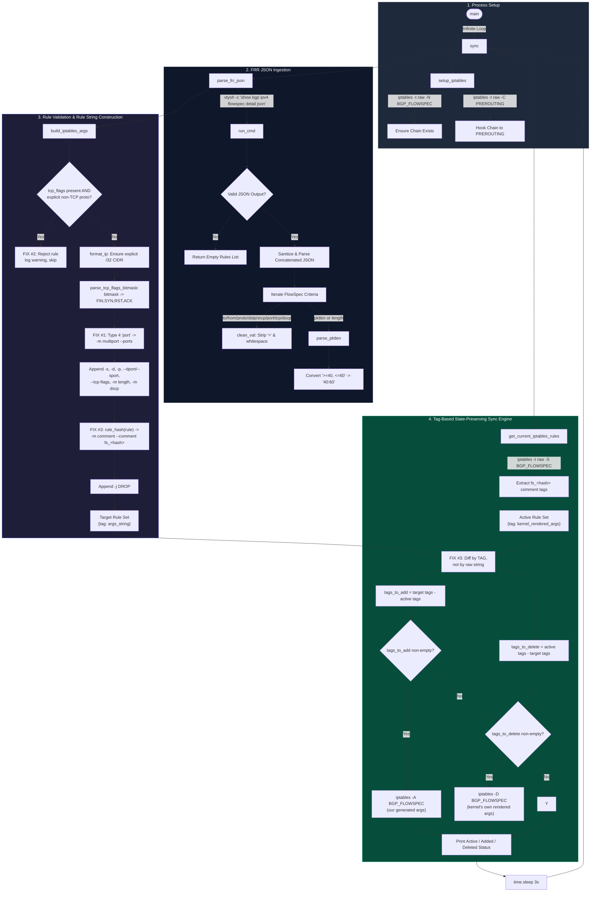
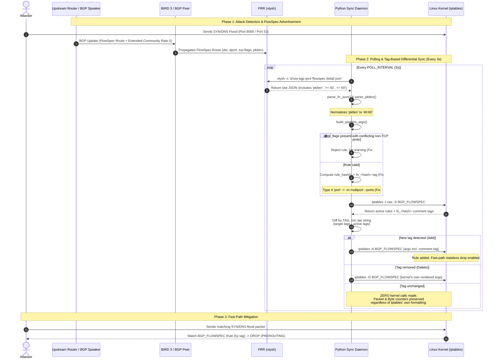

```mermaid
flowchart TD
    subgraph Initialization ["1. Process Setup"]
        A([main]) -->|Infinite Loop| B[sync]
        B --> C[setup_iptables]
        C -->|iptables -t raw -N BGP_FLOWSPEC| C1[Ensure Chain Exists]
        C -->|iptables -t raw -C PREROUTING| C2[Hook Chain to PREROUTING]
    end

    subgraph Parsing ["2. FRR JSON Ingestion"]
        B --> D[parse_frr_json]
        D -->|vtysh -c 'show bgp ipv4 flowspec detail json'| E[run_cmd]
        E --> F{Valid JSON Output?}
        F -- No --> F_Empty[Return Empty Rules List]
        F -- Yes --> G[Sanitize & Parse Concatenated JSON]
        G --> H[Iterate FlowSpec Criteria]
        H -->|to/from/proto/dstp/srcp/port/tcp/dscp| I[clean_val: Strip '=' & whitespace]
        H -->|pktlen or length| J[parse_pktlen]
        J --> J1["Convert '>=40, <=60' -> '40:60'"]
    end

    subgraph Canonical ["3. Rule Validation & Rule String Construction"]
        D --> K[build_iptables_args]
        K --> K1{tcp_flags present AND<br/>explicit non-TCP proto?}
        K1 -- Yes --> K2["FIX #2: Reject rule<br/>log warning, skip"]
        K1 -- No --> L[format_ip: Ensure explicit /32 CIDR]
        L --> M[parse_tcp_flags_bitmask:<br/>bitmask -> FIN,SYN,RST,ACK]
        M --> N1["FIX #1: Type 4 'port' -><br/>-m multiport --ports"]
        N1 --> N2[Append -s, -d, -p, --dport/--sport,<br/>--tcp-flags, -m length, -m dscp]
        N2 --> N3["FIX #3: rule_hash(rule) -><br/>-m comment --comment fs_&lt;hash&gt;"]
        N3 --> N4[Append -j DROP]
        N4 --> O["Target Rule Set<br/>{tag: args_string}"]
    end

    subgraph SyncEngine ["4. Tag-Based State-Preserving Sync Engine"]
        B --> P[get_current_iptables_rules]
        P -->|iptables -t raw -S BGP_FLOWSPEC| P1[Extract fs_&lt;hash&gt; comment tags]
        P1 --> Q["Active Rule Set<br/>{tag: kernel_rendered_args}"]

        O & Q --> R["FIX #3: Diff by TAG,<br/>not by raw string"]
        R --> S["tags_to_add = target tags - active tags"]
        R --> T["tags_to_delete = active tags - target tags"]

        S --> U{tags_to_add non-empty?}
        U -- Yes --> V["iptables -A BGP_FLOWSPEC<br/>(our generated args)"]
        U -- No --> W

        T --> W{tags_to_delete non-empty?}
        W -- Yes --> X["iptables -D BGP_FLOWSPEC<br/>(kernel's own rendered args)"]
        W -- No --> Y

        V & X & Y --> Z[Print Active / Added / Deleted Status]
    end

    Z --> Sleep[time.sleep 3s] --> B

    style Initialization fill:#1e293b,stroke:#475569,color:#fff
    style Parsing fill:#0f172a,stroke:#334155,color:#fff
    style Canonical fill:#1e1e38,stroke:#4338ca,color:#fff
    style SyncEngine fill:#064e3b,stroke:#059669,color:#fff
```

```mermaid
sequenceDiagram
    autonumber
    actor Attacker
    participant Upstream as Upstream Router / BGP Speaker
    participant BIRD as BIRD 3 / BGP Peer
    participant FRR as FRR (vtysh)
    participant Daemon as Python Sync Daemon
    participant Kernel as Linux Kernel (iptables)

    Note over Upstream, Kernel: Phase 1: Attack Detection & FlowSpec Advertisement
    Attacker->>Kernel: Sends SYN/DNS Flood (Port 8000 / Port 53)
    Upstream->>BIRD: BGP Update (FlowSpec Route + Extended Community Rate 0)
    BIRD->>FRR: Propagates FlowSpec Route (dst, dport, tcp-flags, pktlen)

    Note over Daemon, Kernel: Phase 2: Polling & Tag-Based Differential Sync (Every 3s)
    loop Every POLL_INTERVAL (3s)
        Daemon->>FRR: vtysh -c 'show bgp ipv4 flowspec detail json'
        FRR-->>Daemon: Return raw JSON (includes 'pktlen': '>= 40 , <= 60')

        Daemon->>Daemon: parse_frr_json() & parse_pktlen()
        Note over Daemon: Normalizes 'pktlen' to '40:60'

        Daemon->>Daemon: build_iptables_args()
        alt tcp_flags present with conflicting non-TCP proto
            Daemon->>Daemon: Reject rule, log warning (Fix #2)
        else Rule valid
            Daemon->>Daemon: Compute rule_hash() -> fs_<hash> tag (Fix #3)
            Note over Daemon: Type 4 'port' -> -m multiport --ports (Fix #1)
        end

        Daemon->>Kernel: iptables -t raw -S BGP_FLOWSPEC
        Kernel-->>Daemon: Return active rules + fs_<hash> comment tags

        Daemon->>Daemon: Diff by TAG, not raw string<br/>(target tags - active tags)

        alt New tag detected (Add)
            Daemon->>Kernel: iptables -A BGP_FLOWSPEC [args incl. comment tag]
            Note over Kernel: Rule added. Fast-path stateless drop enabled.
        else Tag removed (Delete)
            Daemon->>Kernel: iptables -D BGP_FLOWSPEC [kernel's own rendered args]
        else Tag unchanged
            Note over Daemon, Kernel: ZERO kernel calls made.<br/>Packet & Byte counters preserved<br/>regardless of iptables' own formatting.
        end
    end

    Note over Attacker, Kernel: Phase 3: Fast-Path Mitigation
    Attacker->>Kernel: Sends matching SYN/DNS flood packet
    Kernel-->>Attacker: Match BGP_FLOWSPEC Rule (by tag) -> DROP (PREROUTING)
```